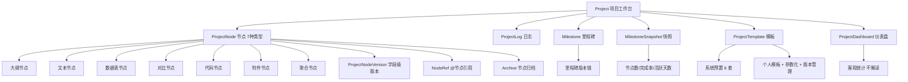

# ADR 0001: Project（项目式探索构建）

## Status

Accepted

## 实现状态（截至 2026-07-02）

### 已实现

- **决策 1-3 节点类型与横切能力**：7 种节点类型 + 字段级版本控制 + `@节点` 引用 + 跨项目节点复制 + 节点归档全部已实现
- **决策 4 双向溯源**：聚合节点拖拽片段 + 段落锚点定位 + 源项目/源节点/段落级追溯已落地
- **决策 5.3 跨模块数据流（事件侧）**：`ProjectNodeExported` 事件使用 `CrossModuleTarget` 枚举统一 `target_module` 字段（`shared/events.py:807-823`）
- **决策 12 事件 schema 实际名称**：
  - 原设计 `Project*` 事件族：实现为 `ProjectCreated` / `ProjectArchived` / `ProjectCompleted` / `ProjectMilestoneMarked` / `ProjectNodeCreated` / `ProjectNodeUpdated` / `ProjectNodeVersionCreated` / `ProjectNodeRolledBack` / `ProjectNodeCompleted` / `ProjectNodeArchived` / `ProjectNodeExported`（共 11 个，`docs/modules/project-based-exploration/events.md`）
- **决策 14 系统辅助边界**：保持"系统不主动"，不破坏
- **节点版本字段级粒度**：`ProjectNodeVersionCreated.changed_fields` 是字段名列表（`["title", "content"]`），未修改字段不产生新版本
- **认知域事件拆分**：旧 `CognitiveNodeUpdated` 已拆分为 `CognitiveNodeLinked`（链接变化）和 `CognitiveNodeMetadataChanged`（元数据变化），`Belief` 不再走 DomainEvent 总线（`shared/events.py:300-335`）

### 与原设计差异

- **关键差异 1（事件循环修复）**：`ProjectNodeCompleted` 消费 `PlanItemCompleted` 后**不重发**源事件，通过 `plan_item_id` 做幂等去重，避免与 Planning 形成事件循环（`docs/modules/project-based-exploration/events.md §3.1.1` + `shared/events.py:775-792` 注释）
- **关键差异 2（target_module 统一）**：`ProjectNodeExported.target_module` 实际为 `CrossModuleTarget` 枚举（`flashcard` / `material` / `cognitive_node` / `plan` / `language_room`），通过 `CrossModuleTarget` 枚举 SSOT 校验（`shared/events.py:47-63` + `services/project/node_ref.py:23`）
- **关键差异 3（事件发布方式）**：节点引用变更通过 `publish_event_safe` 异步发布（`services/project/node_ref.py:78-79`），不再使用 deprecated 的 `asyncio.get_event_loop()`
- **关键差异 4（认知模型桥接）**：7 个架构修复中的 `#4 知识模型统一 KnowledgeAtom 桥接层` + `#7 CognitiveNode 场景化拆分 MasteryAtom/Profile` 已落地（`backend/app/domain/knowledge/knowledge_atom.py`、`backend/app/domain/cognitive/profiles.py`）
- **关键差异 5（领域层基础设施隔离）**：`domain/` 层已实现 `get_repo()` 模式替代直接 import（`backend/app/application/di.py`）

### 待修复

- **待修复 1**：跨项目节点复制的循环检测 `creates_cycle` 标记已实现但仅警告，未阻断（设计意图，保持"用户主导"）
- **待修复 2**：200+ 节点项目的自动折叠/搜索性能优化尚需前端验证（按设计稿已实现基础折叠）
- **待修复 3**：对话上下文注入的"用户对每个节点配置是否允许注入"粒度开关尚未在前端实现（功能上隐式按当前查看节点注入）

## Context

### 要解决的问题

学习者经常会遇到以下场景：

- 围绕一本书或一个主题做**数周到数月**的深度研究
- 对一道难题做多解分析
- 跟踪一个长期项目（学一门编程语言、做毕业设计）
- 把多本书、多个卡片的观点综合起来形成自己的解读

这些场景的共同特点：

- **跨度长**：数天到数月
- **结构化**：需要任务拆解、层级组织
- **跨模块**：要调用知识图谱、卡片、练习、阅读
- **以用户为主**：AI 不主导，工具要克制

现有模块都不适合承担这个角色：

- 知识图谱承载定义和关联，不承载探索过程
- 卡片是知识点级别的产物，不承载过程
- 练习是短时反馈，不支持长期任务

因此需要新建一个**项目式探索构建模块**。

### 模块定位

一个**完全由用户主导的项目工作台**：

- 系统提供结构化工具和数据呈现
- 系统不做任何自动拆解、推荐、规划、评估
- 所有内容、关联、决策都由用户主动完成
- 系统的角色：搜索、统计、版本记录、跨模块联通

### 与现有模块的关系

- **数据归属**：项目自有数据存项目存储；项目提取出的卡片 / 练习归属对应模块；个人注释归属知识图谱
- **跨模块数据流**：项目可调用其他模块的搜索能力，并被其他模块反向引用
- **事件流**：项目操作产生事件进入全局事件流
- **中心认知数据**：项目不直接写入知识点属性，关联关系存项目侧

## Decision

### 1. 节点类型（7 种）

每种节点是**承载内容形态的容器**，性质相同：

| 节点类型 | 功能 | 关键能力 |
|---------|------|---------|
| 大纲节点 | 分组和层级组织 | 不承载具体内容，仅作组织 |
| 文本节点 | 富文本编辑 | 支持 LaTeX 公式、嵌入其他节点引用 |
| 数据表节点 | 可编辑表格 | 支持基础公式（求和 / 均值）、跨节点引用、反查被引用关系 |
| 对比节点 | 多列并排 | 每列独立富文本+公式、可关联卡片 / 知识点、按列引用 |
| 代码节点 | 代码编辑 | 语法高亮、独立版本链（粒度到字段） |
| 附件节点 | 文件 / 图片 | 上传与预览 |
| 聚合节点 | 成果汇总 | 拖入其他节点片段、自由排序、双向溯源 |

**节点类型 7 种** = 内容形态的分类。版本控制是横切能力（见 §2），不作为节点类型。

### 2. 横切能力（所有节点自动拥有）

#### 2.1 版本控制

- **触发**：节点任意字段修改自动入栈
- **粒度**：字段级（标题、描述、正文各自独立版本）
- **能力**：
  - 任意两历史版本 diff
  - 单字段回滚
  - 保留回滚点（回滚操作本身也入栈）
- **存储**：项目自有存储，关联到具体节点

#### 2.2 节点引用

- 任意节点可通过 `@节点` 语法引用其他节点
- 引用以**链接卡片**形式展示被引节点摘要
- **跨节点数据同步**：被引节点修改时，引用处显示"已过期"标识
- **支持跨项目引用**：可引用其他项目中的节点（仅链接，不复制内容）

#### 2.3 跨项目节点复制

- 支持整组节点复制到另一个项目
- 复制时保留引用关系和关联
- 目标项目可选择"链接复制"（保留回链）或"深度复制"（完全独立）

#### 2.4 节点归档

- 节点可标记"归档"（区别于删除）
- 归档节点默认折叠隐藏，可通过筛选器显示
- 归档不删除历史版本

### 3. 规模管理（应对 200+ 节点项目）

- **大纲视图折叠**：节点数 > 50 时自动启用折叠模式
- **全局搜索**：跨节点全文搜索（标题 + 正文 + 附件名）
- **筛选器**：按节点类型、状态、标签、关联模块筛选
- **节点批量操作**：批量移动、批量打标签、批量归档
- **关联关系组织**：
  - 关联可加自定义标签
  - 关联可分组（如"参考资料组""数据来源组"）
  - 支持批量移除关联

### 4. 双向溯源

所有从项目向外输出的内容都必须保留**反向链接**：

| 输出物 | 溯源信息 |
|--------|---------|
| 提取的卡片 | 源项目 + 源节点 + 节点内位置（段落锚点） |
| 提取的练习 | 源项目 + 源节点 |
| 发布的个人注释 | 源项目 + 源节点 + 节点内位置 |
| 聚合节点片段 | 源节点 + 节点内位置 |
| 规划模块的调度项 | 源项目 + 源节点 |

点击溯源链接可直接跳回源节点的源位置。

### 5. 跨模块数据流

#### 5.1 进度回写

- 项目节点可关联练习题组
- 练习模块完成度（X / Y 题）定期回流到项目节点
- 节点详情页显示"关联练习完成度"徽标
- 节点状态可手动或自动更新（用户配置阈值，如"完成 80% 自动标记为已完成"）

#### 5.2 对话上下文注入

- 用户在项目内打开对话模块时，**当前查看的节点**自动作为上下文注入
- 注入内容包括：节点类型、节点内容、关联资源列表
- 用户可手动调整注入范围（当前节点 / 整个项目 / 自定义子集）
- 注入的上下文在对话中以"项目上下文"标识可见
- 用户对每个节点可配置"是否允许注入"（隐私边界）

#### 5.3 项目事件粒度

项目操作产生**三类事件**：

| 事件类型 | 触发条件 | 流向 |
|---------|---------|------|
| 项目生命周期 | 创建、完成、归档 | 全局事件流 |
| 里程碑 | 用户标记里程碑 | 全局事件流 |
| 节点操作（可选）| 用户可配置"哪些节点操作生成事件"，默认仅生成里程碑和完成事件 | 全局事件流 |

#### 5.4 个人注释反查

- 在知识图谱节点详情页"关联项目心得"列表中点击注释
- 跳转到源项目的源节点，并定位到注释对应的内容位置

### 6. 资源关联

用户可在任何节点上手动搜索并关联：

- 知识图谱知识点
- 卡片
- 阅读材料 / 片段
- 练习题组

关联展示资源摘要，可直接跳转。

### 7. 项目日志

- 每个项目独立日志区
- 富文本条目，按时间排列
- 可关联到具体任务节点
- 日志条目可发布为个人注释

### 8. 成果板（聚合节点的实例化）

- 聚合节点 = 项目内的成果板
- 从各节点拖入片段
- 自由排序、添加分隔、标题
- 导出为 Markdown / JSON 格式
- 双向溯源到源节点

### 9. 视图切换

3 种视图，用户手动切换：

| 视图 | 用途 |
|------|------|
| 大纲视图（默认）| 树形结构，编辑和组织 |
| 时间线视图 | 按创建 / 修改时间排列，展示进展 |
| 知识关联视图 | 渲染项目内关联的知识点图谱关系 |

### 10. 里程碑快照

- 用户手动标记里程碑
- 触发**项目级整体快照**：节点数、关联数、完成率、活跃天数、日志条数
- 里程碑间可对比差异
- 快照不可修改

### 11. 项目仪表盘

客观统计，不做解读或建议：

- 节点总览（总数、类型分布、状态比例）
- 关联统计（各模块关联数量）
- 时间统计（创建天数、活跃天数）
- 日志统计
- 里程碑对比

### 12. 对外输出能力（6 项，全部保留）

1. **提取为卡片**：用户选中内容→生成卡片，关联知识点、卡片类型、复习队列；卡片归属卡片模块
2. **提取为练习**：用户选中对比 / 数据表内容→生成选择题 / 填空题
3. **发布为个人注释**：项目心得发布到知识图谱节点，与定义层分离
4. **输出到规划模块**：标记"纳入日程"的节点作为调度项，状态回写
5. **生成项目事件**：完成 / 里程碑 / 手动重要发现进入全局事件流
6. **关联技能标签**：项目作为能力证据来源汇聚到技能面板

### 13. 项目模板

#### 13.1 系统预置模板

| 模板 | 适用场景 | 预设节点组合 |
|------|---------|------------|
| 主题研究 | 人物 / 历史 / 专题 | 大纲+文本+对比+附件 |
| 解题分析 | 一题多解 / 题型归纳 | 大纲+对比+文本+数据表 |
| 实验记录 | 实验类 | 大纲+数据表+附件+文本 |
| 项目实践 | 技术搭建 / 手工 | 大纲+文本+代码+附件 |
| 长篇阅读 | 书籍精读 | 大纲+文本+对比+聚合 |
| 长期训练 | 写作 / 编程 / 语言 | 大纲+文本+数据表+聚合 |

#### 13.2 个人模板

- 用户可将当前项目结构保存为个人模板
- 模板支持**参数化**（用户可在新建时指定参数，如"学习语言 = Python"）
- 模板可**版本管理**（v1 / v2），用户切换版本不影响已建项目

### 14. 系统辅助边界

**系统可以做**：

- 提供搜索、筛选、统计、跳转
- 展示关联来源和反向链接
- 记录所有操作历史
- 格式转换辅助（通过 AI 对话：用户描述→格式化输出→用户确认填入）
- 自动注入上下文（用户当前查看的节点）
- 进度回写（用户配置阈值后自动更新状态）

**系统不可以做**：

- 自动生成项目结构或任务列表
- 自动推荐应学习什么
- 自动评估知识缺口或给出学习建议
- 自动调整知识点掌握度
- 一键填充或生成任何内容
- AI 对话主动介入或主动给出方向性建议

## Consequences

### 正面

- 用户有了一个**长期结构化探索**的统一工作台
- 与现有模块（知识图谱、卡片、练习、阅读、规划）形成完整闭环
- 版本控制、双向溯源、进度回写、对话上下文注入等机制让长跨度项目可维护
- 模板系统（含参数化和版本管理）降低重复项目结构的搭建成本

### 负面

- 7 种节点类型 + 横切能力 + 双向溯源，**功能复杂度高**，需要清晰的前端表达
- 跨模块数据流（进度回写、上下文注入、事件粒度）增加后端耦合点
- 200+ 节点项目的性能需要专门优化
- 个人模板的参数化和版本管理增加实现成本

### 风险

- 节点间引用（@节点）的"过期"机制需要明确的产品定义，避免误更新
- 跨项目节点复制可能引发循环引用
- 对话上下文注入的隐私边界需要明确（用户可能不希望某些节点被注入）

## 附录：3 个压力测试场景

### 场景 A：短期任务——一题多解分析

**用户行为**：数学学到导数应用题，对一道经典题做出 3 种解法，比较优劣。

**节点使用**：

- 对比节点（3 列：解法 A / B / C，每列独立富文本 + 公式）
- 数据表节点（"解法效率对比"：耗时、计算量、适用条件）
- 文本节点（个人心得："这道题的关键突破口是 X"）

**关键能力覆盖**：

- 对比节点列内 LaTeX 公式
- 数据表跨节点引用对比节点里某一列的耗时数据
- 成果板拖拽 3 列结论
- 数据表反查"被对比节点引用"

### 场景 B：长期项目——Python 系统学习

**用户行为**：从基础语法学到实战项目，分阶段推进 3-6 个月。

**节点使用**：

- 一级大纲："基础 / 进阶 / 实战"
- 二级大纲：每个阶段的子模块
- 代码节点：每个子模块下挂关键代码段
- 附件节点：截图、报错信息
- 文本节点：踩坑日志

**关键能力覆盖**：

- 200+ 节点的折叠、搜索、归档
- 代码节点字段级版本控制，5 次迭代后回到第 2 版对比
- 跨项目节点复制：基础学习完后，AI 部分的代码节点整组复制到新项目
- 关联练习题组后，节点详情页显示"已完成 12/20 题"徽标
- 节点状态自动更新（用户配置"完成 80% 自动标记为已完成"）

### 场景 C：跨模块联动——苏东坡主题研究

**用户行为**：通读 3 本苏东坡相关书籍，结合知识图谱做"个人化解读"。

**节点使用**：

- 聚合节点：最终文章大纲（从各节点拖入片段）
- 文本节点：每本书的要点摘录
- 对比节点：3 本书对同一事件的描述对比
- 附件节点：年表、地图

**跨模块联动**：

- 关联阅读模块：3 本书的引用片段（关联可加标签分组"参考资料组"）
- 关联知识图谱：北宋党争、宋代文学等知识点
- 关联卡片：用户此前已积累的"诗词卡片"
- 提取为卡片：研读后选中片段生成卡片，卡片详情中可跳回源节点源位置
- 发布为个人注释：对"北宋党争"知识点发布"苏东坡视角"，在知识图谱里点击注释可跳回源节点
- 生成项目事件：研究完成时进入全局事件流（默认仅生成里程碑和完成事件）
- 输出到规划模块：标记"纳入日程"的节点作为调度项
- 对话模块：在项目内打开对话时，当前查看的节点自动作为上下文注入

**关键能力覆盖**：

- 60+ 关联的标签、分组、批量操作
- 聚合节点片段的双向溯源（点击片段可跳回源节点源位置）
- 个人注释的反查跳转
- 对话上下文注入（用户对每个节点配置"是否允许注入"）

---

## 层级概念图

---

## 数据归属表

| 表/实体 | 主要字段 | 写入方 | 读取方 | 触发场景 |
|--------|---------|--------|--------|----------|
| `projects` | id, user_id, name, status | api/project/routes.py | services/project/* + project/dashboard | 用户创建/完成/归档项目 |
| `project_nodes` | id, project_id, type, title, content, status, archived | api/project/routes.py | api/project + project/dashboard + planning 消费 | 节点增删改、归档 |
| `project_node_versions` | node_id, field, version_no, value, changed_at | services/project/version.py | api/project/version_diff | 节点字段修改触发字段级快照 |
| `project_node_refs` | source_node_id, target_node_id, status(过期) | services/project/node_ref.py | 引用方节点 + 跨项目复制 | `@节点` 引用 + 跨项目复制 |
| `project_logs` | id, project_id, content, linked_node_id | api/project/logs.py | api/project/logs + 提取为个人注释 | 用户写日志条目 |
| `project_milestones` | id, project_id, name, marked_at | api/project/milestones.py | project/dashboard + planning | 用户标记里程碑 |
| `project_milestone_snapshots` | milestone_id, node_count, completion_rate, active_days | services/project/snapshot.py | project/milestone_compare | 标记里程碑时自动生成 |
| `project_templates` | id, user_id, name, params_schema, version | api/project/templates.py | project/new_from_template | 用户保存为模板 |
| `project_events` | 11 个 Project* 事件 | services/project/event_emitter.py | 全局事件流 + knowledge_graph 消费者 | 生命周期/里程碑/节点操作 |
| `project_node_exports` | export_id, source_node_id, target_module(CrossModuleTarget) | services/project/node_ref.py | flashcard/practice/cognitive_node/plan/language_room | 提取为卡片/练习/注释/规划/话题 |
