# ADR 0004: LanguageRoom（实时语音房间）

## Status

Accepted

## 实现状态（截至 2026-07-02）

### 已实现

- **决策 1 数据归属**：参与者各自存（`user_id` 隔离的房间数据）
- **决策 2 房间可见性**：邀请制（生成邀请链接/密码）
- **决策 3 事件模型**：房间结束触发单一聚合事件 `LanguageRoomCompleted`，按参与者维度**分别构造**
- **决策 4 实时语音**：LiveKit 集成（`realtime.py`）+ STT/TTS（`stt_tts.py`）
- **决策 5 AI 角色共享 tool registry**：AI 角色服务独立部署，**共享** `app.infrastructure.llm.tool_repository`（`services/liveroom/ai_persona.py:46-83`），**不直接复用** conversation-system 的 SSE pipeline
- **决策 6 AI 纠错倾向**：用户主动选择（3 档：`none` / `occasional` / `proactive`，`ai_persona.py:32-35`）
- **决策 7 错误标记更新 Belief**：用户主动标记错误 → 触发 `LanguageRoomErrorMarked` → 创建/更新 `ErrorBookEntry` → **不直接更新 Belief**，通过 `ErrorBookEntryReviewed` 路径间接更新
- **决策 8 心情压力模块依赖解耦**：接口 `voice_feature_stream` 已定义，0005 可选消费
- **决策 9 场景与项目平行**：场景（`Scenario`）和项目（`Project`）维度不同
- **决策 10 录音可选**：用户配置
- **决策 11 转写数据各自分开**：按参与者维度分别存储
- **场景系统**：系统预置 + 用户自定义 + 模板保存
- **AI 角色**：同伴（`ai_companion`）+ 辅助者（`ai_assistant`），侵入度 3 档（`low` / `medium` / `high`）
- **对话辅助工具**：快捷短语 + 知识点速查 + 词汇便签（复用 FlashCard `cross_module_source='language_room'`）+ 文字辅助区（复用 ExplainCard）
- **错误标记**：`LanguageRoomErrorMarked` 事件，**复用 `ErrorBookEntry`**

### 与原设计差异

- **关键差异 1（路径：模块名 `liveroom` 而非 `language_room`）**：实际代码路径为 `/backend/app/api/liveroom/` + `/backend/app/services/liveroom/`（文档目录保持 `language-room/` 命名约定）。**跨模块引用**使用字符串 `CrossModuleTarget.LANGUAGE_ROOM = "language_room"`（`shared/events.py:56`）
- **关键差异 2（事件 schema 实际名称）**：
  - 原设计稿 4 个事件，实际为 16 个 `LanguageRoom*` 事件（`shared/events.py:1198-1458` + `docs/modules/language-room/events.md`）：
    - 生命周期 4 个：`LanguageRoomCreated` / `LanguageRoomStarted` / `LanguageRoomEnded` / `LanguageRoomCompleted`
    - 参与者 4 个：`LanguageRoomParticipantJoined` / `LanguageRoomParticipantLeft` / `LanguageRoomAIPersonaJoined` / `LanguageRoomAIPersonaLeft`
    - 场景与转写 2 个：`LanguageRoomScenarioChanged` / `LanguageRoomTranscriptSegmentAdded`（高频）
    - 录音 2 个：`LanguageRoomRecordingStarted` / `LanguageRoomRecordingStopped`
    - 学习闭环 3 个：`LanguageRoomErrorMarked` / `LanguageRoomVocabularyCaptured` / `LanguageRoomMessagePosted`
    - AI 辅助 1 个：`LanguageRoomAIHelperInvoked`
- **关键差异 3（命名统一 — `nodes_linked` → `linked_node_ids`）**：`LanguageRoomCompleted.nodes_linked` 旧命名已统一为 `linked_node_ids`（`shared/events.py:1254`），与 Project/Reading 命名一致
- **关键差异 4（错误标记 → Belief 路径）**：原设计说"触发 `CognitiveNodeUpdated` 事件"，**实际是**经 `ErrorBookEntry` 流程 → `ErrorBookEntryReviewed` 事件 → 知识图谱消费更新 Belief。**不**直接更新 Belief（`docs/modules/language-room/events.md §5`）
- **关键差异 5（错误标记字段类型）**：实际 `error_type` 为 `grammar` / `vocabulary` / `pronunciation` / `coherence`（`shared/events.py:1433`），与原设计"语法/词汇/发音"扩展了"连贯性"
- **关键差异 6（词汇便签实现）**：实际使用 `cross_module_source='language_room'`，**不**直接写 `card_type='data'` 字面量（`shared/events.py:1407-1414` 注释 + `liveroom_tools.py:36`）
- **关键差异 7（AI 辅助 helper_type 枚举）**：实际为 `grammar` / `vocabulary` / `sentence_pattern` 3 类（`shared/events.py:1395`）
- **关键差异 8（转写片段事件粒度）**：每个转写片段发 1 个 `LanguageRoomTranscriptSegmentAdded`（高频事件），按 `user_id` + `room_id` 路由（`shared/events.py:1307-1325`），不聚合
- **关键差异 9（AI 角色加入/离开独立事件）**：原设计未拆分，实际为 `LanguageRoomAIPersonaJoined` + `LanguageRoomAIPersonaLeft` 独立事件（`shared/events.py:1357-1382`），与真人参与者事件分离

### 待修复

- **待修复 1**：原设计"AI 角色配置为"中级、不纠错、低侵入度""中"中级"代表"熟练程度（初级/中级/高级/母语）"，实际未单独建表存储 AI 同伴语言熟练度，仅做简化参数透传
- **待修复 2**：原设计"跨语种 STT 多语种识别（英语为主，中文片段）"实际未做多语种自动切换，需用户主动配置每个房间的 STT 语言
- **待修复 3**：LiveKit 自部署 vs LiveKit Cloud 二选一未在配置中实现自动检测，当前依赖环境变量
- **待修复 4**：录音文件"30 天后清理"定时任务尚未实现（设计稿要求，存储层仅做标记）
- **待修复 5**：场景与项目联动（场景被项目节点关联）未端到端打通（场景元数据已就绪，项目侧关联 UI 待补）
- **待修复 6**：`voice_feature_stream` 实时流实际未在 0005 MoodStress 模块中订阅（0005 模块为简化版本，行为信号 7 类中"voice_features"信号类型已定义但未真正实现订阅）
- **待修复 7**：AI 角色"主动纠错"虽用户选择，但"仅在用户个人侧边区显示"目前是后端设计保证，前端侧边区 UI 尚未实现差异化

## Context

### 要解决的问题

语言学习的核心痛点是**真实场景对话练习**：

- 背单词、做语法题不解决"开口说"的问题
- 缺乏与真实同伴或 AI 角色对话的脚手架
- 场景化练习（咖啡馆点餐、面试、商务谈判）需要工具支持
- AI 反馈如果不专业会误导学习

现有系统：

- `conversation-system`（单用户 SSE + LLM tool calling）只支持 1v1 对话
- 知识图谱、FlashCard、阅读、规划等模块都是单用户
- 没有实时多人 / 语音 / STT / TTS 能力
- 没有"场景"概念
- 心情压力模块（ADR 0005）尚未设计

**关键洞察**：这是一个**多人 + 实时 + 语音**的全新范式，引入后会影响全系统架构（从纯单用户到支持多用户共享空间）。

### 关键定位：单用户系统上的多人扩展

| 层级 | 现有归属 | 本模块定位 |
|------|---------|----------|
| 单用户维度 | `user_id` 隔离的数据模型 | **不破坏**，本模块数据按参与者维度存 |
| 多人共享维度 | ❌ 现有无 | **本模块引入**：房间元数据共享（场景、参与者、时长） |
| 实时通信 | SSE（单用户） | **本模块引入**：WebRTC（LiveKit 托管） |
| AI 对话 | 1v1 LLM | **本模块引入**：N 参与者 + M AI 角色 |
| 场景化 | ❌ 现有无 | **本模块引入**：场景系统 |

### 模块定位

一个**用户主导的多人语音房间**：

- 提供实时语音基础设施
- 场景脚手架（不强制流程）
- AI 角色工具（同伴 + 辅助者）
- 学习数据记录与转写
- **不评判**发音、语法、流利度
- **不强制**任何流程或脚本

### 与现有系统的关系

| 对方 | 语言多人模块提供 | 语言多人模块使用 |
|------|---------------|----------------|
| `conversation-system` | — | 共享 tool registry（不直接复用 SSE pipeline） |
| `CognitiveNode` | 错误标记回写 Belief、知识点关联 | 知识点 mastery、卡片关联显示 |
| `FlashCard`（ADR 0002）| 从转写记录生成卡片 | FlashCard 多源提取接口 |
| 阅读模块（ADR 0003） | 关联材料、ExplainCard 上下文 | 标注、笔记、ExplainCard 机制 |
| 项目模块（ADR 0001） | 房间作为项目任务节点；转写导出到项目成果板 | 项目节点引用、聚合节点 |
| 规划模块 | 房间事件排入日程 | 调度接口 |
| 心情压力模块（ADR 0005） | 提供语音特征数据（语速、停顿、音量）| 心情/压力信号输入（**接口解耦**，不依赖 0005 实现） |
| 全局事件流 | `LanguageRoomCompleted` 事件 | 消费知识点更新事件 |
| 认证系统 | 多用户身份（参与者、AI 角色） | 用户档案 |

## Decision

### 1. 关键架构决策（11 个）

#### 决策 1：数据归属——参与者各自存 ✅ 已确认

- **房间元数据**（场景、参与者列表、时长、AI 角色配置）共享存储
- **房间内容数据**（转写、录音、标注、关联、错误标记）按参与者维度拆开存
- 房主没有"所有权"特权，参与者数据互相不可见（除非用户主动分享）
- 房间结束不删除任何参与者数据，由用户各自决定保留/删除

理由：保护隐私，避免"房间内一人删除导致数据丢失"。

#### 决策 2：房间可见性——邀请制（推荐，待确认）

- 房间默认**邀请制**：房主生成邀请链接/密码，受邀者加入
- 不开放"公开房间列表"（避免运营负担和垃圾信息）
- MVP 不实现用户搜索/发现机制

#### 决策 3：事件模型——房间事件聚合后分发 ✅ 已确认

- 房间结束触发**单一聚合事件** `LanguageRoomCompleted`
- 事件按参与者维度**分别构造**（每个参与者收到自己的版本）
- 每个版本包含该用户相关的转写、错误标记、生成的卡片等
- 不在事件总线层暴露跨用户聚合数据

```python
class LanguageRoomCompleted(DomainEvent):
    user_id: str  # 接收方（每个参与者各收一份）
    room_id: str
    session_id: str  # 该用户在该房间的 session
    material_id: str | None
    scenario_id: str | None
    duration_seconds: float
    transcript_segments: list[TranscriptSegment]  # 仅该用户可见部分
    errors_marked: int
    cards_generated: int
    nodes_linked: list[str]  # 旧命名，新事件统一为 linked_node_ids
    ai_help_requests: int
    completed_at: datetime

class TranscriptSegment:
    speaker_id: str  # 参与者 ID
    speaker_name: str
    text: str
    start_time: float
    end_time: float
    is_self: bool  # 是否为该用户发言
```

#### 决策 4：实时语音技术栈——LiveKit 托管 ✅ 已确认

- 使用 **LiveKit**（开源 + 托管服务）作为实时音视频基础设施
- 优势：自带 SFU、TURN/STUN、客户端 SDK
- 集成方式：LiveKit Cloud 或自部署 LiveKit Server
- STT：通过 LiveKit 的 STT 插件或独立 Whisper 服务
- TTS：通过 LiveKit 的 TTS 插件或独立云服务（用于 AI 角色）
- 状态同步（参与者进出、AI 角色行为）：通过 LiveKit data channel 或独立 WebSocket

#### 决策 5：AI 角色接入——共享 tool registry ✅ 已确认

- AI 角色服务**独立部署**，但**共享 `shared/protocols/` 的 tool registry**
- AI 角色能调用：
  - 知识图谱查询（搜索知识点）
  - FlashCard 创建（基于 AI 角色对话内容）
  - ExplainCard 创建（绑定对话消息）
  - 场景提示词查询
- AI 角色**不**直接复用 conversation-system 的 SSE pipeline（不适合多人并发）
- 房间内 AI 角色调度由**房间调度器**管理（决策谁先回、回什么）

#### 决策 6：AI 纠错倾向——用户主动选择（推荐，待确认）

- AI 纠错倾向（不纠错/偶尔纠错/主动纠错）是**用户配置项**
- 明确为"用户主动选择"，**不是** AI 主动评判
- 系统默认不纠错（与"系统不评判"原则一致）
- 即使用户选择"主动纠错"，纠错信息也只在**该用户个人侧边区**显示，不影响其他参与者
- 房主无法为他人的 AI 行为做设置

理由：保留"系统不评判"原则的同时，给有需求的用户提供可选项。

#### 决策 7：错误标记更新 Belief——是（推荐，待确认）

- 用户在房间内**手动标记自己的错误** → 关联到知识点 → 触发 `CognitiveNodeUpdated` 事件
- 标记是**用户主动行为**，是 Belief 的合法来源
- 与 0003 阅读的对比：阅读是"被动接收"，不更新 Belief；**标记错误是"主动学习"**，更新 Belief
- 与 ADR 0002 FlashCard 一致：用户主动行为更新 Belief

#### 决策 8：心情压力模块依赖——解耦（推荐，待确认）

- 不等 ADR 0005，先定义**接口契约**
- 接口：房间可选输出 `voice_feature_stream`（语速、停顿、音量变化）
- 0005 心情压力模块作为可选消费者订阅此流
- 即使 0005 不存在，房间功能完整可用
- 数据格式：每秒一次的滑动窗口特征向量

#### 决策 9：场景与项目的关系——平行（推荐，待确认）

- 场景（Scenario）= **会话脚手架**（短时，单次或几次对话）
- 项目（Project，ADR 0001）= **长期任务工作台**（跨周跨月）
- 维度不同，**不互相包含**
- 房间可以**被**项目节点关联（项目里可以组织多次房间练习）
- 场景模板与项目模板独立维护

#### 决策 10：录音存储——可选（推荐，待确认）

- 用户可设置"是否录音"（默认开启，可关闭）
- 录音文件存**参与者私有**存储
- 录音**不**长期保存，默认 30 天后清理（用户可延长或永久保留）
- 房间结束时不自动删除录音
- 录音文件不进入知识图谱，仅用户个人可回听

#### 决策 11：转写数据——各自分开（推荐，待确认）

- 完整转写记录按参与者维度**分别存储**
- 每个参与者看到的转写相同（除非有人中途加入或退出）
- 错误标记、关联知识点都是参与者私有
- 不存在"房间共享转写本"的概念

### 2. 房间系统

#### 创建房间

- 用户创建房间，设定：房间名称、场景、是否允许 AI 角色加入、最大人数（2-8）
- 房间可见性：邀请制（生成邀请链接/密码）
- 实时语音：LiveKit 房间
- 可选开启文字辅助区（用于链接、单词拼写）

#### 加入与退出

- 通过邀请链接或密码进入
- 房间内显示参与者列表
- 支持静音自己或他人（房主权限，仅对真人；AI 角色由调度器管理）

#### 房间控制（房主权限）

- 管理参与者：静音、移除、转让房主
- 切换场景（房间内实时切换）
- 邀请 AI 角色加入或移出
- 控制 AI 辅助功能开关（针对**房主自己**，不替他人决定）
- 开始/暂停/结束录音

### 3. 场景系统

#### 场景定义

| 字段 | 类型 | 说明 |
|------|------|------|
| `id` | UUID | 主键 |
| `name` | str | 场景名称 |
| `description` | str | 场景描述 |
| `roles` | list[RoleConfig] | 参与者角色设定 |
| `linked_node_ids` | list[str] | 关联知识点（从知识图谱手动选取） |
| `goals` | list[str] | 目标任务 |
| `prompts` | list[str] | 提示词（房间内浮动显示） |
| `is_system` | bool | 系统预设/用户自定义 |
| `created_by` | str | 创建者用户 ID |

#### 场景来源

- 系统预置一套常用场景模板（日常对话、学术讨论、商务）
- 用户可创建自定义场景
- 用户可保存场景为个人模板
- 加入房间时可预览场景全部设定

### 4. AI 虚拟角色

#### 角色类型

- **AI 同伴**：参与对话的伙伴，可配置语言水平、性格、语速、口音、纠错倾向
- **AI 辅助者**：静默监听，被召唤时提供帮助

#### AI 同伴配置

| 维度 | 选项 |
|------|------|
| 基础人设 | 名称、性别声线、性格描述 |
| 语言属性 | 目标语言、熟练程度（初级/中级/高级/母语）、语速、口音 |
| 行为倾向 | 健谈/简洁、纠错倾向（**用户配置项**）、是否主动引导话题 |
| 角色背景 | 基于场景自动适配，用户可自定义 |

#### AI 接入机制

- AI 角色服务**独立**部署（不在 conversation-system 中）
- 通过共享 tool registry 调用现有工具
- 房间调度器管理 AI 角色的发言时机（不与用户抢话）
- AI 角色的 STT/TTS 通过 LiveKit 通道

#### AI 行为侵入度（用户级配置）

- **低**：仅在用户明确召唤时响应
- **中**：检测到明显卡顿时以文字形式提示（仅该用户可见）
- **高**：在对话自然间隙主动提供改进建议（仍为个人提示）

> **重要**：所有 AI 行为输出都在**用户个人侧边区**，不公开给房间内其他人，避免尴尬。

### 5. 对话辅助工具（纯手动）

- **快捷短语**：用户预设的常用表达，一键发送
- **知识点速查**：查看场景关联知识点的卡片摘要，不离开房间界面
- **词汇便签**：临时记录生词，对话后处理 → **复用 FlashCard 数据卡片类型**（`card_type='data'`, `source='language_room'`），不新建独立数据结构
- **举手发言**：发送发言请求，房主可看到排队顺序
- **文字辅助区**：用于链接、拼写、补充说明（**复用 ExplainCard 浮卡机制**作为补充）

### 6. 学习数据闭环

#### 实时转写

- 对话过程中实时 STT，以字幕形式可选显示
- 完整转写记录**按参与者维度分别保存**
- 录音可选（用户配置）

#### 对话后处理

- 用户回看自己的转写记录
- 手动标记自己的错误 → **复用 `ErrorBookEntry` 错题本**（已含 `is_resolved` / `next_review` / `error_type` / `referenced_materials` 字段）
  - 错误标记 = 新建/更新一条 `ErrorBookEntry`
  - 关联到 `linked_node_ids`（多知识点可指定主+次）
  - 自评"困难/良好/简单"复用 `ErrorBookEntry.review_count` 字段
  - **不**新建独立的"错误标记"数据结构，避免双系统
- 从转写选中句子生成 FlashCard（`source='language_room'`）
- 从转写触发对话模块进行语法分析

#### 数据反馈

- 求助次数、错误标记数 → 事件流
- 错误标记通过 `ErrorBookEntryCreated` / `ErrorBookEntryReviewed` 事件回写 Belief（与练习模块一致）
- 个人统计（发言时长、词汇多样性、语速、求助次数）仅用户本人可见

### 7. 会话回顾仪表盘

每次对话结束后生成回顾页（用户个人版）：

- 对话基本信息（场景、参与者、时长、日期）
- 个人统计（发言占比、新词汇列表、求助次数、错误标记数）
- 知识点覆盖（场景关联 + 用户手动标记）
- 生成的卡片和笔记列表
- 转写全文（支持按说话人筛选、按关键词搜索）

### 8. 与其他模块联动

| 联动方向 | 内容 |
|---------|------|
| 知识图谱 | 场景关联知识点、转写中错误标记关联、查阅知识点 |
| FlashCard（ADR 0002）| 从转写记录生成卡片、对话中查阅关联卡片 |
| 阅读模块（ADR 0003）| 关联材料作为房间主题、ExplainCard 上下文 |
| 项目模块（ADR 0001） | 房间作为项目任务节点、转写导出到项目成果板 |
| 规划模块 | 对话练习事件排入日程、"距上次练习 N 天"提示 |
| 心情压力模块（ADR 0005）| 语音特征数据流（**接口已定义，实现解耦**）|
| 对话模块（conversation-system）| 共享 tool registry，AI 角色调用工具 |
| 事件流 | `LanguageRoomCompleted` 事件（按参与者维度）|

### 9. 系统边界

**语言多人模块可做**：

- 实时语音房间（LiveKit 托管）
- 场景脚手架、AI 角色模拟、个人求助响应
- 实时 STT、录音、转写
- 错误标记（**复用 `ErrorBookEntry`**）、关联知识点、生成 FlashCard
- 词汇便签（**复用 FlashCard 数据卡片类型**）
- 文字辅助（**复用 ExplainCard**）
- 调用共享 tool registry

**语言多人模块不做**：

- 自动评判发音、语法、流利度（不自动打分）
- 在对话中主动公开指出任何人的错误
- 强制按场景脚本推进对话
- 自动分析或评价用户的语言能力等级
- 公开房间列表、用户搜索/发现
- 录音进入知识图谱
- 跨参与者共享转写/笔记（隐私优先）

## Consequences

### 正面

- 引入多人 + 实时 + 语音能力，补全语言学习闭环
- 数据归属参与者各自存，保护隐私
- 房间事件聚合后分发，与现有单用户事件总线兼容
- LiveKit 托管减少自建 WebRTC 的开发量
- AI 角色共享 tool registry，复用知识图谱、FlashCard 等能力
- 错误标记作为 Belief 合法来源，与 FlashCard、阅读模块的主动行为原则一致
- 心情压力模块通过接口解耦，不阻塞 0004 实现
- 场景与项目平行，覆盖不同时间维度的需求

### 负面

- 引入多用户共享空间，全系统数据模型需要支持"按参与者拆数据"
- LiveKit 托管依赖第三方服务（可用自部署缓解）
- AI 角色服务独立部署 + 共享 tool registry，架构复杂度提升
- 转写 STT 多语种支持需要对接多个云服务
- 房间事件按参与者分发，事件总线负载增加
- 实时多人 + AI 调度的并发处理需要专门的房间调度器

### 风险

- LiveKit 服务可用性影响房间功能
- 录音/转写数据增长快，存储成本与隐私合规需评估
- AI 角色"主动纠错"即使是用户选择，仍可能让对话尴尬
- 公开房间未实现，未来扩展需要重新设计可见性模型
- 多语种混合场景的 STT/TTS 准确度依赖第三方服务

## 附录：3 个压力测试场景

### 场景 A：1v1 房间——用户与 AI 同伴练习

**用户行为**：用户单独进入房间，与一个 AI 同伴用英语练习咖啡馆点餐。

**流程**：

- 邀请制房间，只有用户 1 人 + AI 同伴（系统预设 "English Barista"）
- 用户开启录音（默认），AI 同伴配置为"中级、不纠错、低侵入度"
- 用户与 AI 对话 15 分钟
- 实时字幕显示（用户开启）
- 5 次求助：用户说"how to order size?"，AI 辅助者弹出"a small/medium/large"提示
- 对话结束：转写保存到用户个人存储
- 用户手动标记 3 处错误，关联到"虚拟语气""过去时态"知识点
- 触发 `LanguageRoomCompleted` 事件 → Belief 更新 + FlashCard 自动生成

**关键能力覆盖**：

- 单人 + 1 AI 角色调度
- 数据归属（用户私有）
- 错误标记更新 Belief
- 转写生成 FlashCard
- AI 辅助者低侵入度
- 事件聚合分发

### 场景 B：多人房间——3 用户 + 2 AI 角色讨论

**用户行为**：3 个用户组成学习小组，用英语讨论"AI 对社会的影响"，房间有 2 个 AI 角色（主持人 + 词汇助手）。

**流程**：

- 房主创建房间，场景：学术讨论，关联"AI 伦理""机器学习"等知识点
- 邀请另外 2 个用户
- 主持人 AI 角色：负责话题引导，配置"高级、健谈、不纠错"
- 词汇助手 AI 角色：负责生词解释，配置"中级、简洁、被动响应"
- 房间调度器协调 AI 角色发言时机（不抢话）
- 3 个用户各自录音，私有转写
- 房主切换场景到"小组辩论"（中间切换）
- 2 小时对话，发言统计各自记录
- 结束后：3 个用户各自生成回顾页面（数据不共享）
- 1 个用户主动把转写片段导出到自己的"AI 学习"项目

**关键能力覆盖**：

- 多人 + 多 AI 角色调度
- 房主权限（切换场景）
- 数据归属（3 用户各自）
- 项目模块联动（导出转写）
- 调度器协调 AI 发言

### 场景 C：跨语种与解耦——心情压力模块未上线

**用户行为**：用户 A（中文母语） 和用户 B（英文母语） 用英文讨论，但用户 A 偶尔表达困难，需要 AI 辅助。

**流程**：

- 跨语种场景：用户 A 偶尔用中文求助 AI 辅助者
- 房间 STT 多语种识别（英语为主，中文片段）
- AI 辅助者提供：语法纠正（"I go to store yesterday" → "I went to the store yesterday"）
- 用户 A 配置 AI "主动纠错"模式（个人选择，不影响 B）
- 房间结束触发 `LanguageRoomCompleted`，包含 `voice_feature_stream` 数据
- **心情压力模块未上线**，但事件流不影响（接口已定义，无消费者）
- 未来 0005 上线后，自然接入 `voice_feature_stream`

**关键能力覆盖**：

- 跨语种 STT
- AI 纠错倾向用户配置（明确为用户选择，不违反"系统不评判"）
- 与心情压力模块的解耦（接口已定义，实现可异步）
- 多语种混合对话
- 未来扩展性（0005 接入不破坏 0004）

---

## 层级概念图

```mermaid
graph TD
    LangRoom[LanguageRoom 实时语音房间] --> Room[RoomMeta 房间元数据 共享]
    LangRoom --> Part[Participant 参与者]
    LangRoom --> Scen[Scenario 场景]
    LangRoom --> AI[AI Persona 角色]
    LangRoom --> Trans[Transcript 转写]
    LangRoom --> Rec[Recording 录音]
    LangRoom --> Tool[Assistant Tools 辅助工具]
    LangRoom --> Voice[voice_feature_stream 语音特征流]

    Room --> Meta[id, name, scenario_id, max_participants, visibility 邀请制]
    Room --> Live[LiveKit 房间]
    Room --> Sched[RoomScheduler 房间调度器]

    Part --> User[真人参与者 按 user_id 隔离]
    Part --> Owner[房主权限 静音/移除/转让/切换场景]
    Part --> PerPart[参与者私有数据 转写/录音/标注/错误标记]

    Scen --> Sys[系统预置 日常/学术/商务]
    Scen --> UserDef[用户自定义]
    Scen --> Tmpl[个人模板]
    Scen --> LinkedNode[linked_node_ids 关联知识点]
    Scen --> Prompts[prompts 提示词]

    AI --> Companion[ai_companion 同伴 参与对话]
    AI --> Assistant[ai_assistant 辅助者 静默监听]
    AI --> Lang[语言属性 初级/中级/高级/母语]
    AI --> Accent[accent 口音]
    AI --> Inv[侵入度 low/medium/high 用户配置]
    AI --> Corr[纠错倾向 none/occasional/proactive 用户配置]

    Trans --> STT[STT 实时转写 按参与者分别存]
    Trans --> Seg[TranscriptSegment speaker_id/text/start_time/end_time/is_self]
    Trans --> ErrMark[ErrorMark 错误标记 复用 ErrorBookEntry]

    Rec --> Opt[用户配置可选]
    Rec --> Store[参与者私有存储]
    Rec --> Clean[30天默认清理]

    Tool --> Phrase[快捷短语]
    Tool --> Quick[知识点速查]
    Tool --> Vocab[词汇便签 复用 FlashCard cross_module_source=language_room]
    Tool --> Hand[举手发言]
    Tool --> Text[文字辅助区 复用 ExplainCard]

    Voice --> Feat[语速/停顿/音量 每秒滑动窗口]
    Voice --> Cons[0005 心情压力模块可选消费]
```



---

## 数据归属表

| 表/实体 | 主要字段 | 写入方 | 读取方 | 触发场景 |
|--------|---------|--------|--------|----------|
| `language_rooms` | id, name, scenario_id, owner_id, max_participants, visibility, status | api/liveroom/routes.py | api/liveroom/* + planning 消费 + project 关联 | 房主创建/结束房间 |
| `language_room_participants` | room_id, user_id, joined_at, left_at, is_ai | services/liveroom/participants.py | api/liveroom/participants + LanguageRoomCompleted 构造 | 加入/退出 |
| `language_room_transcripts` | id, room_id, user_id, segment_id, speaker_id, speaker_name, text, start_time, end_time, is_self | services/liveroom/stt_tts.py | api/liveroom/transcript + 回顾仪表盘 + 错误标记消费者 | 实时 STT 片段 |
| `language_room_recordings` | id, room_id, user_id, file_path, started_at, ended_at, size_bytes | services/liveroom/recording.py | api/liveroom/recording/个人回听 | 用户开启录音 |
| `language_scenarios` | id, name, description, roles, linked_node_ids, goals, prompts, is_system, created_by | api/liveroom/scenarios.py | api/liveroom/scenarios + 房间创建预览 | 系统预置/用户自定义 |
| `ai_personas` | id, name, role_type(companion/assistant), language_level, accent, correction_tendency, intrusiveness | services/liveroom/ai_persona.py | api/liveroom/ai + 房间调度器 | 用户配置 AI 角色 |
| `language_room_error_marks` | id, room_id, user_id, segment_id, error_type(grammar/vocabulary/pronunciation/coherence), linked_node_ids, error_book_entry_id | services/liveroom/error_mark.py | api/errorbook + LanguageRoomCompleted 构造 + knowledge_graph 消费者 | 用户手动标记错误 |
| `language_room_vocabulary_notes` | id, room_id, user_id, word, meaning, flashcard_id | services/liveroom/vocab.py | api/flashcard 复习 + language_room 回顾 | 词汇便签（生成 FlashCard）|
| `language_room_events` | 16 个 LanguageRoom* 事件 (Created/Started/Ended/Completed/ParticipantJoined/Left/AIPersonaJoined/Left/ScenarioChanged/TranscriptSegmentAdded/RecordingStarted/Stopped/ErrorMarked/VocabularyCaptured/MessagePosted/AIHelperInvoked) | services/liveroom/event_emitter.py | 全局事件流 + ErrorBookEntry 消费者 + 0005 心情压力消费者 + 0001 Project 消费者 | 房间生命周期/参与者进出/转写片段/错误标记 |
| `voice_feature_streams` | room_id, user_id, timestamp, speech_rate, pause_count, volume | services/liveroom/voice_features.py | 0005 mood_stress 可选订阅 | STT 实时输出（用户开启后）|
