# ADR 0005: MoodStress（认知状态感知与调节）

## Status

Accepted

## 实现状态（截至 2026-07-02）

### 已实现

- **核心定位**：作为秘书系统的**扩展模块** `mood_stress` 注册，复用 `SecretaryModule` 契约 + 事件消费 + `Proposal` 机制
- **决策 1 情绪标签体系**：复用 `EmotionAnalyzer.EMOTION_CATEGORIES` 的 11 类标签
- **决策 2 手动 vs 自动冲突**：手动优先展示 + 自动参考信号（实际通过 `source` 字段区分：`manual` / `system`）
- **决策 3 行为信号 vs CognitiveLoad**：两者协同，0005 **不修改** `CognitiveLoad` 字段
- **决策 4 干预工具的边界**：不进入知识图谱，4 种工具仅 `intervention_logs` 落库
- **决策 5 情绪仪表盘扩展**：`frontend/src/app/emotion/page.tsx` 复用
- **决策 6 细粒度隐私控制**：`mood_stress_prefs` 表 + 用户级开关
- **决策 7 与语言多人模块的接口**：复用 `voice_feature_stream` 接口，0005 可选消费
- **决策 8 数据存储**：扩展 `emotion_records` 表 + 新建 `mood_stress_prefs` + `intervention_logs` + `behavior_signals`
- **决策 9 跨设备同步**：自然继承秘书系统
- **决策 10 历史数据迁移**：`EmotionAnalyzer` 缓存保留为 `source='auto'`
- **用户主动记录**：心情 + 压力自评 + 能量自评（`emotion_records` 扩展 source + `mood_note` + `stress_level` + `energy_level` 字段）
- **4 种干预工具**：呼吸引引 / 知识呼吸 / 认知重评 / 环境切换
- **心情压力规则**：`MoodStressRuleTriggered` 事件通知规划/对话模块

### 与原设计差异

- **关键差异 1（source 字段拆分）**：`MoodStressRecorded.source` 实际为**两个互斥字段**（`shared/events.py:547-571`）：
  - `source: Literal["manual", "system"]` = 本模块内部来源
  - `cross_module_source: Literal["assistant_dialog", "language_room"] | None` = 跨模块引用来源
  - 与 `FlashCardCreated` / `ReadingNoteCreated` 的拆分模式一致
- **关键差异 2（事件 schema 实际名称）**：
  - 原设计稿 3 个事件（`MoodStressRecorded` / `InterventionTriggered` / `MoodStressRecorded` rule 变种），实际为 5 个（`shared/events.py:547-647` + `docs/modules/mood-stress/events.md`）：
    - `MoodStressRecorded`（用户主动记录）
    - `MoodStressInterventionTriggered`（干预工具）
    - `MoodStressRuleTriggered`（规则触发）
    - `MoodStressBehaviorSignalDetected`（行为信号）
    - `MoodStressPrefsUpdated`（偏好更新）
- **关键差异 3（intervention_type 枚举值扩展）**：原设计 4 种中文，实际为 `breathing` / `knowledge_breathing` / `cognitive_reappraisal` / `environment`（`shared/events.py:582-585`）
- **关键差异 4（行为信号 signal_type 7 类）**：原设计未明确枚举，实际为 `task_switch` / `stay_duration` / `error_rate` / `undo` / `session_anomaly` / `flashcard_failure` / `voice_features` 7 类（`shared/events.py:617-624`）
- **关键差异 5（rule action 枚举）**：实际为 `postpone_high_intensity` / `only_flashcard` / `suggest_break` 3 类（`shared/events.py:605`）
- **关键差异 6（pressure_score / energy_score 字段命名）**：原设计"压力值"实际为 `pressure_score` + `energy_score`（`shared/events.py:563-564`），不用 `stress_level` / `energy_level`
- **关键差异 7（SecretaryModule 契约落地）**：秘书系统通过 `app/services/secretary/modules/mood_stress.py` 注册扩展模块，使用 `run_check` 返回空 `Proposal` 列表（避免自动打扰）
- **关键差异 8（`related_event_ids` 关联字段）**：实际 `MoodStressRecorded` 携带 `related_event_ids: list[str]`（关联触发本次记录的源事件），原设计未提及

### 待修复

- **待修复 1**：`voice_feature_stream` 实时流订阅未实现（接口已定义，0005 行为信号 7 类中 `voice_features` 类型已声明但未实际接收房间流）
- **待修复 2**：`MoodStressRuleTriggered.action` 路由到规划模块的"标记受影响项"逻辑部分实现（按 `source_module="project"` + `is_mood_rule_affected=True`），其他 2 个 action 待补
- **待修复 3**：干预工具的"知识呼吸"虽然只读，但"用户在压力下点击知识呼吸"的实际触发率与效果未做端到端验证
- **待修复 4**：情绪仪表盘"行为信号摘要"区域目前为简化展示，与秘书 `fatigue_manager` 输出的优先级/合并规则未完全定义
- **待修复 5**：跨设备同步虽然"自然继承"，但 `mood_stress_prefs` 表的同步机制仍需前端确认（用户配置变更 → 跨设备 → 一致性延迟）
- **待修复 6**：`text_note` 富文本存储目前为 TEXT 字段，前端编辑器未限制长度（DB 端建议 2000 字以内）
- **待修复 7**：11 类情绪标签对中文用户的可读性 UX 测试未做

## Context

### 要解决的问题

学习者的认知状态（情绪、压力、能量）显著影响学习效率。当前痛点：

- 压力大时强行学高难度内容，事倍功半
- 焦虑时缺乏即时调节工具
- 情绪低落时对话/规划模块不知道如何配合
- 缺乏"用户主动感知 + 系统辅助调节"的统一接口

### 关键定位：秘书系统的扩展模块

读完 `services/analytics/emotion_analyzer.py`（358 行已有情绪分析代码）和 `docs/specs/05-secretary-system.md` 后，发现：

**现有系统已实现的能力**：

| 能力 | 现有归属 | 状态 |
|------|---------|------|
| 情绪自动检测（11 类）| `EmotionAnalyzer` | ✅ 已实现 |
| 趋势分析、洞察生成 | `EmotionAnalyzer.analyze_trend` | ✅ 已实现 |
| 对话上下文注入 | `EmotionAnalyzer.build_emotion_context` | ✅ 已实现 |
| 疲劳检测 + 静默时段 + 推送上限 | 秘书 `fatigue_manager` | ✅ 已实现 |
| 学习行为信号采集 | 秘书事件消费 | ✅ 已实现 |
| 情绪仪表盘页面 | `frontend/src/app/emotion/` | ✅ 已实现 |

**结论**：0005 应该是**秘书系统的扩展模块**（`mood_stress`），**复用**秘书的事件消费、提案机制、`SecretaryModule` 契约，**不重建**已有能力。

### 核心定位：扩展而非重建

```
秘书系统 (SecretarySystem)
├── 内置模块
│   ├── review_reminder
│   ├── fatigue_manager  ← 复用
│   └── daily_brief
└── 扩展模块 (本 ADR 新增)
    └── mood_stress
        ├── 用户主动记录（心情/压力/能量自评）
        ├── 干预工具（呼吸引导/知识呼吸/认知重评/环境切换）
        ├── 细粒度隐私控制
        └── 行为信号详细面板
```

### 复用原则 vs 新建原则

**复用**（不重建）：

- 情绪自动检测 → 复用 `EmotionAnalyzer.classify/quick_detect`
- 趋势分析 → 复用 `EmotionAnalyzer.analyze_trend`
- 对话上下文注入 → 复用 `EmotionAnalyzer.build_emotion_context`
- 疲劳检测 → 复用秘书 `fatigue_manager` 模块
- 行为信号采集 → 复用秘书事件消费
- 静默时段/推送上限 → 复用 `SecretaryPrefs`
- 状态展示 → 复用秘书 `Proposal` 机制

**新建**（与秘书互补）：

- 用户主动记录（手动心情/压力/能量自评）
- 干预工具（4 种用户主动触发的调节工具）
- 细粒度隐私控制（行为信号逐项开关）
- 数据保留期管理

### 模块定位

一个**用户主导的情绪调节辅助层**：

- **不诊断**情绪障碍
- **不替代**心理健康专业服务
- **不评判**用户的状态
- **不自动**修改任何学习数据
- **所有干预工具由用户手动触发**

### 与现有系统的关系

| 对方 | 心情压力模块提供 | 心情压力模块使用 |
|------|--------------|--------------|
| 秘书系统 | 作为 `mood_stress` 扩展模块注册 | 复用 `SecretaryModule` 契约、事件消费、Proposal 机制 |
| `EmotionAnalyzer` | 触发 `MoodStressRecorded` 事件标注手动记录 | 复用 `classify/analyze_trend/build_emotion_context` |
| 规划模块 | 输出当前压力/能量 + 用户配置规则 | 调度接口 |
| 对话模块（conversation-system）| 注入用户主动标记的情绪状态 | 复用 `build_emotion_context` |
| 语言多人模块（ADR 0004）| 接收 `voice_feature_stream` 数据 | 复用 ADR 0004 定义的接口 |
| 知识图谱 | "知识呼吸"工具的只读访问 | 知识点 mastery、关联卡片查询 |
| FlashCard（ADR 0002）| "知识呼吸"工具的只读访问 | 卡片查询（不修改 FSRS 调度）|
| 全局事件流 | `MoodStressRecorded` / `InterventionTriggered` 事件 | 消费其他事件 |

## Decision

### 1. 模块注册与契约

```python
# 实现 SecretaryModule 契约
class MoodStressModule(SecretaryModule):
    @property
    def meta(self) -> ModuleMeta:
        return ModuleMeta(
            name="mood_stress",
            display_name="心情压力感知",
            emoji="🌊",
            description="用户主动记录心情/压力/能量，配合 4 种干预工具",
            default_enabled=True,
            run_interval_seconds=300,  # 5 分钟检查一次
            version="1.0.0",
        )
    
    async def run_check(self, user_id, ctx=None) -> list[Proposal]:
        # 不自动生成提案（避免打扰）
        # 只在用户主动记录后输出事件
        return []
```

### 2. 关键设计决策（10 个）

#### 决策 1：情绪标签体系——统一为现有 11 类 ✅

- 复用 `EmotionAnalyzer.EMOTION_CATEGORIES` 的 11 类标签
- 不再独立定义"专注/疲惫/焦虑/兴奋/平静"等标签
- 用户手动记录时下拉选择这 11 类（可多选）
- 与自动检测标签体系**完全统一**

理由：避免双标签体系导致数据无法对齐。

#### 决策 2：手动 vs 自动冲突——手动优先 ✅

- 用户**主动记录**的情绪标签在仪表盘顶部展示
- 自动检测的情绪标签作为"参考信号"在下方展示
- 两者**互不覆盖**，并存展示
- 用户可手动隐藏自动检测结果

理由：尊重用户主观判断，避免"系统比我更懂我"的失控感。

#### 决策 3：行为信号 vs CognitiveNode.CognitiveLoad——协同 ✅

- `CognitiveNode.CognitiveLoad.intrinsic/dynamic` 已有认知负荷数据
- 0005 的"行为信号"（频繁切换/错误率突增/延长会话）是**外部可观察信号**
- 两者一起分析：
  - `CognitiveLoad` 是"内部认知状态"
  - 行为信号是"外部行为表现"
  - 共同构成"压力"的多维证据
- 0005 **不修改** `CognitiveLoad` 字段（只读消费）

#### 决策 4：干预工具的边界——不进入知识图谱 ✅

| 干预工具 | 边界 |
|---------|------|
| 5 分钟呼吸引导 | 不进入任何数据，纯前端动画 |
| 知识呼吸 | **只读**访问已有卡片，**不修改** FSRS 调度，不生成新事件 |
| 认知重评引导 | 仅模板化提问，**不做**心理分析 |
| 环境切换 | 仅前端 UI 变化（主题/背景音），不进入数据 |

理由：避免"调节"工具反向影响学习数据，保持"系统不主动"原则。

#### 决策 5：情绪仪表盘——扩展现有页面 ✅

- 复用 `frontend/src/app/emotion/page.tsx`
- 扩展新区域：手动记录入口、干预工具面板、隐私设置入口
- 现有自动检测展示区**保留**

#### 决策 6：细粒度隐私控制——用户级 ✅

```python
class MoodStressPrefs:
    user_id: str
    # 行为信号逐项开关
    behavior_signal_collect: dict[str, bool] = {
        "task_switching": True,      # 频繁切换任务
        "stay_duration": True,        # 同一知识点停留时长
        "error_rate": True,            # 错误率突增
        "session_duration": True,      # 会话时长异常
        "voice_features": False,       # 语音特征（默认关闭，需用户主动开启）
    }
    # 干预工具可见性
    intervention_visibility: dict[str, bool] = {
        "breath": True,
        "knowledge_breath": True,
        "cognitive_reappraisal": True,
        "environment_switch": True,
    }
    # 手动记录提醒
    manual_reminder_enabled: bool = False
    manual_reminder_interval: str = "weekly"  # daily/weekly/none
    # 数据保留期
    data_retention_days: int = 90  # 默认 90 天
    # 是否允许语言模块接入语音特征
    voice_feature_stream_enabled: bool = False
```

- 所有开关默认**保守**（语音特征默认关闭、提醒默认关闭）
- 用户可逐项控制

#### 决策 7：与语言多人模块的接口——复用 ADR 0004 ✅

- 复用 ADR 0004 定义的 `voice_feature_stream` 接口
- 0005 作为**可选消费者**订阅此流
- 用户需在 0005 设置中**主动开启** `voice_feature_stream_enabled` 才会订阅
- 0005 不存在时，ADR 0004 的房间功能不受影响

#### 决策 8：数据存储——扩展现有 emotion 表 ✅

```sql
-- 扩展 emotion_records 表（已存在）
ALTER TABLE emotion_records ADD COLUMN source VARCHAR(20) DEFAULT 'auto';
-- source: 'auto' (EmotionAnalyzer) | 'manual' (用户主动)

ALTER TABLE emotion_records ADD COLUMN mood_note TEXT;
-- 用户手动记录时填写的备注

ALTER TABLE emotion_records ADD COLUMN stress_level INT;
-- 1-10 压力自评

ALTER TABLE emotion_records ADD COLUMN energy_level INT;
-- 1-10 能量自评

-- 新增 mood_stress_prefs 表
CREATE TABLE mood_stress_prefs (
    user_id VARCHAR(64) PRIMARY KEY,
    behavior_signal_collect JSONB,
    intervention_visibility JSONB,
    manual_reminder_enabled BOOLEAN DEFAULT FALSE,
    manual_reminder_interval VARCHAR(20) DEFAULT 'weekly',
    data_retention_days INT DEFAULT 90,
    voice_feature_stream_enabled BOOLEAN DEFAULT FALSE
);

-- 新增 intervention_logs 表
CREATE TABLE intervention_logs (
    id UUID PRIMARY KEY,
    user_id VARCHAR(64),
    intervention_type VARCHAR(32),  -- breath / knowledge_breath / cognitive_reappraisal / environment_switch
    duration_seconds FLOAT,
    context JSONB,
    triggered_at TIMESTAMP
);
```

#### 决策 9：跨设备同步——自然继承秘书 ✅

- 作为秘书扩展模块，存储在业务数据库（与用户其他数据同库）
- 跨设备同步通过现有认证 + 数据同步机制
- **不需**新建同步通道

#### 决策 10：历史数据迁移——EmotionAnalyzer 缓存作为 auto ✅

- 现有 `EmotionAnalyzer._cache` 内存数据**保留**为 `source='auto'`
- 新建 `mood_stress_records` 表时，把 `EmotionRecord` 数据**批量迁移**过来
- 迁移后 `EmotionAnalyzer` 不再单独维护缓存，统一读 `emotion_records` 表

### 3. 用户主动记录

#### 心情记录

- 用户手动选择当前情绪标签（可多选，从 11 类标签中选）
- 支持添加简短文字备注（富文本）
- 记录频率完全由用户决定
- 可选设置定时提醒（提醒可关闭）

#### 压力自评

- 1-10 分量表
- 默认显示"上次压力值"作为参考
- 可关联到具体学习会话（来自练习/对话/项目）

#### 能量自评

- 1-10 分量表，用于区分"精神充沛"和"身体疲劳"
- 可关联到一天中的具体时间段

### 4. 状态仪表盘（扩展现有页面）

#### 当前状态视图

- **顶部**：用户最近一次主动记录（手动优先）
- **中部**：行为信号摘要（来自秘书事件消费的检测结果）
- **底部**：近 7 天趋势图（心情、压力、能量）
- 右上角：手动记录入口按钮

#### 周期统计

- 按日/周/月查看心情分布、压力均值、能量均值
- 行为信号频率趋势
- 用户可手动关联：查看某段时间学习数据与心情压力曲线（系统只并列展示，不做因果推断）

### 5. 干预工具（4 种）

| 工具 | 触发方式 | 行为 | 数据写入 |
|------|---------|------|---------|
| 5 分钟呼吸引引 | 用户点击 | 简单动画引导呼吸节奏 | 仅 `intervention_logs` |
| 知识呼吸 | 用户点击 | 从知识图谱随机调取**掌握良好且近期未回顾**的卡片，舒缓展示 | 仅 `intervention_logs`，**不**修改 FSRS 调度 |
| 认知重评引导 | 用户点击 | 结构化提示：发生了什么、我的想法、有没有其他解释、我能做什么 | 仅 `intervention_logs` |
| 环境切换 | 用户点击 | 切换学习界面主题色调和背景音 | 仅前端 UI，**不**入数据库 |

**核心原则**：
- 工具由用户**手动触发**，系统不主动推送
- 工具**不修改**任何学习数据
- 工具**不进入**知识图谱
- 工具使用记录生成 `InterventionTriggered` 事件，但**不更新** CognitiveNode

### 6. 与规划/对话/语言模块的联动

#### 输出给规划模块

- 当前压力值（手动优先，无手动时用行为信号推断）
- 当前能量值
- **可配置规则**（用户在 0005 中设置）：
  - 压力 ≥ 7 → 推迟高强度任务
  - 能量 ≤ 3 → 仅安排卡片复习
- 规划模块根据规则调整当日学习计划

#### 输出给对话模块

- 当前情绪状态（**用户主动标记的**优先）
- 对话模块可据此调整回复语气和支持策略
- 复用 `EmotionAnalyzer.build_emotion_context` 接口

#### 输出给语言多人环境模块（双向）

- 0005 提供语音特征数据存储（`voice_feature_stream`）
- 语言模块的压力信号回写到 0005

### 7. 新增事件 schema

```python
class MoodStressRecorded(DomainEvent):
    """用户主动记录心情/压力/能量"""
    user_id: str
    record_id: str
    source: Literal["manual"]  # 本事件仅用于手动记录
    mood_tags: list[str]       # 与 11 类标签对齐
    mood_note: str | None
    stress_level: int | None   # 1-10
    energy_level: int | None   # 1-10
    related_session_id: str | None
    recorded_at: datetime

class InterventionTriggered(DomainEvent):
    """干预工具使用记录"""
    user_id: str
    intervention_type: Literal[
        "breath", "knowledge_breath", 
        "cognitive_reappraisal", "environment_switch"
    ]
    duration_seconds: float
    context: dict | None
    triggered_at: datetime
```

**关键设计**：0005 的事件**不触发** `CognitiveNodeUpdated`。原因：
- 干预工具是"调节"而非"学习"
- 用户主动记录的情绪**不直接**代表认知状态变化
- 避免双系统更新 Belief

### 8. 隐私与控制

- 所有心情压力数据默认为**私密**，仅用户本人可见
- 用户可手动删除任意历史数据
- 数据保留期（默认 90 天），过期自动清除
- 行为信号自动采集可逐项开关
- 向规划/对话/语言模块输出的数据内容和范围由用户控制，可随时切断
- 语音特征流默认**关闭**，需用户主动开启

### 9. 系统边界

**心情压力模块可做**：

- 用户主动记录（心情/压力/能量自评）
- 4 种干预工具（用户手动触发）
- 复用秘书系统的行为信号展示
- 复用 `EmotionAnalyzer` 的自动检测展示
- 输出压力/能量给规划模块（按用户配置规则）
- 输出情绪状态给对话模块（复用现有接口）
- 接收 `voice_feature_stream` 数据（用户开启后）

**心情压力模块不做**：

- 诊断情绪障碍、心理健康问题
- 自动评判/打分/评价用户状态
- 主动推送心情记录提醒（除非用户开启）
- 修改任何学习数据（Belief、FSRS 调度、知识点属性）
- 在用户未开启时收集行为信号
- 在用户未开启时收集语音特征
- 替代专业心理咨询

## Consequences

### 正面

- 复用 `EmotionAnalyzer` 现有 358 行代码，**不重建**情绪分析
- 复用秘书 `fatigue_manager` 疲劳检测，**不重复**造轮子
- 复用 `SecretaryModule` 契约，与秘书系统架构一致
- 与 ADR 0004 通过 `voice_feature_stream` 接口解耦
- 干预工具**不修改**学习数据，保持"系统不主动"原则
- 细粒度隐私控制，符合 GDPR 等隐私规范
- 历史数据自然迁移，`source='auto'` 与 `source='manual'` 区分清晰

### 负面

- 需要扩展现有 `emotion_records` 表（迁移工作）
- 11 类情绪标签对用户来说可能太多（需要 UX 优化）
- 行为信号逐项开关的配置页面需要设计
- 干预工具的"知识呼吸"是**只读**——这意味着用户调节后，调节效果**不能反馈**到 FSRS 调度
- 手动记录 vs 自动检测的"并存展示"可能让仪表盘变得复杂

### 风险

- 干预工具被用户当作"逃避学习"工具（需要 UX 引导）
- 认知重评引导可能被误用为心理治疗（需要明确边界提示）
- 跨设备同步如果延迟，可能造成数据不一致
- 语音特征流开启后，存储和隐私合规需要评估
- 11 类标签对中文用户的可读性需要测试

## 附录：3 个压力测试场景

### 场景 A：基础使用——用户主动记录 + 干预工具

**用户行为**：用户感觉今天压力大，手动记录心情并使用呼吸引导。

**流程**：

- 用户进入 `emotion/page.tsx` → 顶部显示上次记录（3 天前）
- 点击"现在记录" → 弹出 11 类标签多选 + 备注 + 压力自评 + 能量自评
- 选择"焦虑""疲惫" + 备注"今天状态不好" + 压力 7 + 能量 4
- 提交 → 触发 `MoodStressRecorded` 事件，存 `emotion_records` (source=manual)
- 仪表盘顶部更新为这次手动记录
- 用户点击"5 分钟呼吸引引" → 触发 `InterventionTriggered` 事件
- 5 分钟后呼吸引导结束，记录到 `intervention_logs`
- **不修改**任何 FSRS 调度、不修改 CognitiveNode

**关键能力覆盖**：

- 用户主动记录
- 手动优先展示
- 干预工具触发
- 事件流但**不更新** Belief

### 场景 B：跨模块联动——压力高时规划自动调整

**用户行为**：用户在期末复习周连续多日高强度，压力值持续 ≥ 7。

**流程**：

- 用户每天手动记录压力（不开提醒，习惯性记录）
- 5 天后，规划模块读取最近 7 天压力均值 = 7.8
- 用户配置的规则触发："压力 ≥ 7 → 推迟高强度任务"
- 规划模块调整次日计划：
  - 推迟：3 道难题（高强度）
  - 保留：20 张 FlashCard 复习（低强度）
  - 新增：5 分钟呼吸引引作为前置（来自 0005 的干预工具）
- 规划模块按 `SecretaryPrefs` 的 `max_proactive_per_day` 控制每日推送数
- 静默时段（22:00-08:00）不推送任何心情压力相关通知
- 行为信号中的"session_duration 异常"被秘书的 `fatigue_manager` 检测到，生成 `Proposal`（不是 0005 直接生成）

**关键能力覆盖**：

- 0005 输出压力值给规划模块
- 规划模块按规则调整
- 复用秘书的推送上限和静默时段
- 行为信号由 `fatigue_manager` 处理，不与 0005 冲突

### 场景 C：语音特征接入——语言多人模块压力信号

**用户行为**：用户在语言房间与 AI 角色对话，AI 检测到用户语速异常、频繁停顿。

**流程**：

- 用户在语言房间中，AI 角色监听到用户语速变慢、停顿增加
- 房间调度器根据 ADR 0004 的设计，可选输出 `voice_feature_stream`
- 用户已在 0005 中开启 `voice_feature_stream_enabled = true`
- 0005 接收语音特征数据：
  - **不直接**生成 `MoodStressRecorded` 事件
  - **只**在仪表盘"行为信号摘要"区域展示"今日检测到：语言房间语速异常、停顿增加"
- 仪表盘**不**自动标记用户为"焦虑"——这是用户主动决定
- 用户看到提示后，可以选择手动记录，或不记录
- **关键边界**：语音特征**不更新** CognitiveNode，不影响 FSRS 调度

**关键能力覆盖**：

- `voice_feature_stream` 接口的解耦实现
- 行为信号 vs 用户主动记录的边界
- **不**自动评判用户状态
- 隐私控制（用户可关闭语音特征接收）

---

## 层级概念图

```mermaid
graph TD
    MoodStress[MoodStress 秘书扩展模块] --> SecMod[SecretaryModule 契约]
    MoodStress --> EmoRec[EmotionRecord 情绪记录]
    MoodStress --> Pref[MoodStressPrefs 用户偏好]
    MoodStress --> Int[Intervention 干预工具]
    MoodStress --> Beh[BehaviorSignals 行为信号]
    MoodStress --> Rule[MoodStressRule 规则]

    SecMod --> Meta[ModuleMeta name=mood_stress run_interval=300s]
    SecMod --> RunCheck[run_check 返回空 Proposal 列表]

    EmoRec --> Src[source manual/system]
    EmoRec --> Cross[cross_module_source assistant_dialog/language_room]
    EmoRec --> Tag[mood_tags 11类 EmotionAnalyzer.EMOTION_CATEGORIES]
    EmoRec --> Note[mood_note 富文本备注]
    EmoRec --> Stress[stress_level 1-10]
    EmoRec --> Energy[energy_level 1-10]
    EmoRec --> Rel[related_event_ids 关联源事件]

    Pref --> BehSwitch[behavior_signal_collect task_switching/stay_duration/error_rate/...]
    Pref --> IntVis[intervention_visibility breath/knowledge_breath/...]
    Pref --> Remind[manual_reminder_enabled + interval]
    Pref --> Retent[data_retention_days 90]
    Pref --> Voice[voice_feature_stream_enabled 默认关闭]

    Int --> Breath[5min 呼吸引引 仅前端动画]
    Int --> KnowBreath[知识呼吸 只读 KG 不修改 FSRS]
    Int --> Reapp[认知重评引导 模板化提问]
    Int --> Env[环境切换 仅前端 UI]

    Beh --> TaskSw[task_switch 频繁切换]
    Beh --> StayD[stay_duration 停留时长]
    Beh --> ErrR[error_rate 错误率突增]
    Beh --> Undo[undo 撤销]
    Beh --> SessAnom[session_anomaly 会话异常]
    Beh --> FCFail[flashcard_failure 复习失败]
    Beh --> VoiceF[voice_features 语音特征 默认关闭]

    Rule --> Action[action postpone_high_intensity/only_flashcard/suggest_break]
    Rule --> Press[压力≥7 推迟高强度]
    Rule --> EnergyL[能量≤3 仅安排卡片]
    Rule --> Out[输出给 0006 Planning 应用]
```



---

## 数据归属表

| 表/实体 | 主要字段 | 写入方 | 读取方 | 触发场景 |
|--------|---------|--------|--------|----------|
| `emotion_records` (扩展) | user_id, source(manual/system), mood_tags, mood_note, stress_level, energy_level, related_event_ids, recorded_at | services/mood_stress/manual_record.py + EmotionAnalyzer 复用 | services/mood_stress/dashboard + 0006 Planning 消费 | 用户主动记录 / 自动检测 |
| `mood_stress_prefs` | user_id, behavior_signal_collect(JSONB), intervention_visibility(JSONB), manual_reminder_enabled, manual_reminder_interval, data_retention_days, voice_feature_stream_enabled | api/mood_stress/prefs.py | services/mood_stress/run_check + 0006 Planning 消费 | 用户配置偏好 |
| `intervention_logs` | id, user_id, intervention_type(breath/knowledge_breath/cognitive_reappraisal/environment_switch), duration_seconds, context(JSONB), triggered_at | services/mood_stress/intervention.py | api/mood_stress/intervention_history + 仪表盘 | 用户点击 4 种干预工具 |
| `behavior_signals` | id, user_id, signal_type(task_switch/stay_duration/error_rate/undo/session_anomaly/flashcard_failure/voice_features), value, detected_at | services/mood_stress/behavior_detector.py (消费秘书事件) | services/mood_stress/dashboard + 0005 Prefs 开关校验 | 秘书事件消费触发 |
| `mood_stress_records` (EmotionAnalyzer 迁移) | EmotionRecord 旧字段 + 新字段 | services/mood_stress/migration.py (一次性) | 统一读 emotion_records 表 | 历史数据迁移 |
| `mood_stress_events` | 5 个 MoodStress* 事件 (Recorded/InterventionTriggered/RuleTriggered/BehaviorSignalDetected/PrefsUpdated) | services/mood_stress/event_emitter.py | 全局事件流 + 0006 Planning 消费者 + 秘书 fatigue_manager | 用户操作/规则触发/偏好变更 |
| `mood_stress_rule_outputs` | id, user_id, rule_id, action, affected_plan_items | services/mood_stress/rule_engine.py | 0006 Planning 消费 | 规则匹配后输出 |
