# ADR 0006: Planning（信息整合视图与手动编排工作台）

## Status

Accepted

## 实现状态（截至 2026-07-02）

### 已实现

- **核心定位**：后端调度引擎的"前端用户工作台"，**不重建**调度逻辑
- **决策 1-10 全部已实现**：
  - 决策 1 与 `AdaptivePlanGenerator`：消费 + 展示 + 手动调整
  - 决策 2 与 `ZPDScheduler`：不涉及（任务级 vs 题目级分工）
  - 决策 3 复习提醒：消费 `review_reminder`
  - 决策 4 疲劳管理：消费 `fatigue_manager`
  - 决策 5 每日简报：消费 `daily_brief`
  - 决策 6 目标日历：复用 `learning_profile.py`
  - 决策 7 习惯学习：消费 `habit_formation.habit_level`
  - 决策 8 心情压力规则：消费 0005 输出
  - 决策 9 自适应推荐 + 手动调整
  - 决策 10 周期回顾：复用 `daily_brief` 机制
- **数据模型**：`plan_items` / `plan_view_layouts` / `plan_goals` / `plan_periodic_reviews` / `plan_drafts` 5 张表
- **视图**：日视图 + 周视图 + 知识视图 + 自定义视图方案
- **执行追踪**：偏差记录 + 完成回写
- **目标管理**：手动设定 + 进度自动更新
- **周期回顾展示**：图表 + 用户手动文字总结

### 与原设计差异

- **关键差异 1（事件循环修复）**：`PlanItemCompleted` 路由到各源模块后**不重发**源事件（如 `ProjectNodeCompleted` / `FlashCardReviewed` 等），通过 `plan_item_id` 做幂等去重（`docs/modules/planning/events.md §3.2` + `shared/events.py:893-914` 注释 + `services/planning/completion_writer.py`）
- **关键差异 2（source_module 统一为 PlanningSourceModule 枚举）**：原设计 `source_module: str` 字面量，实际为 `PlanningSourceModule` 枚举 SSOT（`shared/events.py:80-95`），合法值：`flashcard` / `practice` / `project` / `reading` / `language_room` / `manual` / `interest_explorer` / `mood_stress`
- **关键差异 3（target_module 统一为 CrossModuleTarget 枚举）**：原设计 `PlanGoalCreated.target_module: str`，实际使用 `CrossModuleTarget` 枚举值（`practice` / `flashcard` / `interest_explorer` / `mood_stress` 等，`shared/events.py:53-63` + 949）
- **关键差异 4（事件 schema 实际名称）**：
  - 原设计稿 4 个事件（`PlanItemScheduled` / `PlanItemCompleted` / `PlanItemSkipped` / `PlanItemExtended`），实际为 12 个（`shared/events.py:837-1014` + `docs/modules/planning/events.md`）：
    - 计划项生命周期 7 个：`PlanItemCreated` / `PlanItemScheduled` / `PlanItemActivated` / `PlanItemStarted` / `PlanItemCompleted` / `PlanItemSkipped` / `PlanItemExtended`
    - 目标 3 个：`PlanGoalCreated` / `PlanGoalProgressUpdated` / `PlanGoalCompleted`
    - 回顾与偏差 2 个：`PlanPeriodicReviewGenerated` / `PlanDeviationRecorded`
- **关键差异 5（Deviation 字段名统一）**：原设计 `deviation_type: Literal["timeout", "skipped", "early_completion", "inserted"]`，实际为 `Literal["timeout", "skip", "early_complete", "extra_insert"]`（`shared/events.py:1006`），与动词一致
- **关键差异 6（PlanItemScheduled 字段）**：实际新增 `is_mood_rule_affected: bool` 字段（原设计稿未提及），由 `MoodStressRuleTriggered` 消费者标记（`shared/events.py:860`）
- **关键差异 7（PlanItemScheduled 字段命名）**：实际携带 `scheduled_for: datetime` + `plan_date: str`（ISO date），与原设计"scheduled_at"不同
- **关键差异 8（PlanItemCompleted 字段扩展）**：实际新增 `actual_minutes: int` + `linked_node_ids: list[str]`（`shared/events.py:908-909`），用于回写到知识图谱关联
- **关键差异 9（target_type 替代 source_module 触发）**：原设计 `PlanItemCompleted.source_module` 路由，实际**同时**使用 `source_module` + `target_type: str` 联合定位（`shared/events.py:906`）
- **关键差异 10（target_module 字段复用 CrossModuleTarget）**：`PlanGoalCreated.target_module` 实际为 `CrossModuleTarget` 枚举字符串（`shared/events.py:949`），强类型校验
- **关键差异 11（完成回写由 `completion_writer.py` 统一处理）**：原设计"回写由各源模块 handler 处理"，**实际**由 `services/planning/completion_writer.py` 集中路由（`source_module` → 调用对应模块 service），避免在 event_bus handler 中分散

### 待修复

- **待修复 1**：自定义视图方案（`plan_view_layouts`）的"考前冲刺 / 日常均衡 / 项目攻坚"预设模板仅数据模型就绪，UI 切换交互待补
- **待修复 2**：知识视图（以知识图谱为背景叠加待办密度）的前端渲染未实现（`backend` 数据可用，`frontend` 缺图谱叠加层）
- **待修复 3**：拖拽时间轴的"30 分钟 / 60 分钟粒度可调"前端组件未实现（基础 60 分钟固定）
- **待修复 4**：习惯学习建议（`habit_formation.habit_level`）消费已就绪，"你通常在周二下午安排项目任务"软提示 UI 待补
- **待修复 5**：心情压力规则 3 个 action（`postpone_high_intensity` / `only_flashcard` / `suggest_break`）路由到规划模块后，目前 `postpone_high_intensity` 实际生效，其他 2 个 action 待补
- **待修复 6**：偏差数据"只用于习惯学习"的消费链路尚未端到端打通（`habit_formation` 模块对 `PlanDeviationRecorded` 的消费待验证）
- **待修复 7**：计划草稿（`plan_drafts`）的"用户编辑中 / 正式计划"边界 UI 待补（数据模型就绪）
- **待修复 8**：日/周/月维度统计（`plan_periodic_reviews.period_type`）切换的前端组件待补
- **待修复 9**：`PlanItemActivated`（到达安排时间触发）目前由前端轮询触发，未接入秘书 `infrastructure/scheduler` 主动调度

## Context

### 要解决的问题

学习者面临的关键痛点：

- 来自 7+ 个模块的待办项散落各处，无法统一查看
- 何时学什么、学多久完全由用户决定，但缺乏"建议池"参考
- 自适应推荐、复习提醒、疲劳信号等后端能力已有，但**前端缺少统一编排界面**
- 计划执行缺乏追踪、偏差没有记录、周期回顾没有数据

### 关键定位：前端用户工作台

读完 `services/analytics/adaptive_planner.py` / `services/knowledge/zpd_scheduler.py` / `services/common/planning_stub.py` / `specs/05-secretary-system.md` 后，发现：

**现有后端调度引擎（已实现）**：

| 能力 | 现有归属 | 状态 |
|------|---------|------|
| 自适应推荐 | `AdaptivePlanGenerator.generate()` | ✅ 已实现 |
| 题目级 ZPD 调度 | `ZPDScheduler` | ✅ 已实现 |
| 复习提醒 | 秘书 `review_reminder` 模块 | ✅ 已实现 |
| 疲劳管理 | 秘书 `fatigue_manager` 模块 | ✅ 已实现 |
| 每日简报 | 秘书 `daily_brief` 模块 | ✅ 已实现 |
| 习惯等级 | `services/analytics/habit_formation.py` | ✅ 已实现 |
| 目标日历 | `learning_profile.py` / `progress.py` | ✅ 已实现 |

**现有前端能力**：

- ❌ 没有统一的"待安排池"汇聚
- ❌ 没有拖拽式时间轴
- ❌ 没有日/周/知识视图切换
- ❌ 没有自定义视图方案
- ❌ 没有计划执行追踪界面
- ❌ 没有偏差记录与展示

**结论**：0006 = **后端调度引擎的"前端用户工作台"**。不重建后端逻辑，专注"汇聚 + 编排 + 追踪"。

### 核心定位：消费者 + 编排入口

```
现有后端调度引擎                            0006（前端工作台）
─────────────────                            ─────────────────
AdaptivePlanGenerator           ──消费→     "建议池"展示
review_reminder (秘书)           ──消费→     "待复习"列表
fatigue_manager (秘书)          ──消费→     疲劳信号展示
daily_brief (秘书)              ──消费→     日总结 + 周期回顾
habit_formation                 ──消费→     习惯等级
0005 心情压力规则               ──消费→     规则应用
0001 项目"纳入日程"节点         ──消费→     项目任务进入待安排池
0002 FlashCard 到期列表         ──消费→     卡片复习进入待安排池
0003 阅读回顾提醒               ──消费→     阅读材料进入待安排池
0004 语言多人练习频率           ──消费→     语言房间进入待安排池
                                          
                                   ←输入      用户拖拽编排
                                   ←输入      用户手动调整
                                   ←输入      执行追踪
                                   ←输入      偏差记录
                                   ←输入      目标管理
                                   ←输入      周期回顾
```

### 复用 vs 新建原则

**复用**（消费后端引擎）：

- 自适应推荐 → 消费 `AdaptivePlanGenerator.generate()`
- 复习提醒 → 消费 `review_reminder` 模块输出
- 疲劳信号 → 消费 `fatigue_manager` 模块输出
- 每日简报 → 消费 `daily_brief` 模块输出
- 周期回顾 → 复用 `daily_brief` 周期机制
- 习惯等级 → 消费 `habit_formation.habit_level`
- 目标日历 → 复用 `learning_profile.py` 现有数据
- 心情压力规则 → 消费 ADR 0005 输出
- 题目级调度 → 0006 **不涉及**（ZPDScheduler 负责题目级）

**新建**（前端工作台）：

- 待安排池（统一待办汇聚）
- 拖拽式时间轴（日/周/知识视图）
- 自定义视图方案
- 执行追踪界面
- 偏差记录
- 目标管理（手动设定）
- 周期回顾展示
- 习惯学习建议的展示

### 模块定位

一个**用户主导的编排工作台**：

- **不**有自己的调度逻辑（由后端引擎提供）
- **不**自动生成计划（自适应引擎给出的是"建议"）
- **不**替代用户做决策
- **不**强制任何学习顺序
- **不**自动填充日程

### 与其他 ADR 模块的关系

| 对方 | 0006 消费 | 0006 输出 |
|------|----------|----------|
| 0001 项目模块 | "纳入日程"的任务节点 | 节点完成事件回写到项目模块 |
| 0002 FlashCard | 到期卡片列表（来自 `review_reminder`） | 复习完成事件回写 |
| 0003 阅读模块 | 阅读回顾提醒 | 阅读完成事件回写 |
| 0004 语言多人 | 练习频率目标、上次练习时间 | 房间安排 + 完成回写 |
| 0005 心情压力 | 调度规则 + 当前压力/能量 | 规则应用结果展示 |

## Decision

### 1. 关键设计决策（10 个）

#### 决策 1：与 AdaptivePlanGenerator 的关系——消费+展示+手动调整 ✅

- 后端 `AdaptivePlanGenerator.generate()` 提供**自适应推荐**
- 0006 将推荐项放入"建议池"
- 用户可：采纳、忽略、修改、删除、添加自己的项
- 核心：**AdaptivePlanGenerator 给的是建议，用户有最终决策权**

理由：与"不自动生成计划"不矛盾——推荐 ≠ 自动执行。

#### 决策 2：与 ZPDScheduler 的关系——不涉及 ✅

- `ZPDScheduler` 是**题目级调度**（从候选池选 3-5 道题）
- 0006 是**任务级编排**（安排"今天学 Python 函数"这个大块）
- **不**互相干涉

#### 决策 3：复习提醒——消费 `review_reminder` ✅

- 0006 不自己计算到期卡片数
- 通过 `Proposal` 机制或事件消费 `review_reminder` 模块输出
- 复习项进入"待安排池"

理由：避免双系统计算同一数据。

#### 决策 4：疲劳管理——消费 `fatigue_manager` ✅

- 0006 不自己实现疲劳检测
- 消费 `fatigue_manager` 的疲劳信号
- 展示在日视图顶部："当前疲劳风险：高"
- 用户可参考此信号调整安排

#### 决策 5：每日简报——消费 `daily_brief` ✅

- 0006 不自己实现日总结
- 消费 `daily_brief` 模块的输出
- 展示在日视图底部

#### 决策 6：目标日历——复用现有 ✅

- `learning_profile.py` 已有目标日历能力
- 0006 消费现有日历数据
- 展示"距考试还有 14 天"等参考信息

#### 决策 7：习惯学习——复用 `habit_formation` ✅

- 0006 不自己实现习惯分析
- 消费 `habit_formation.habit_level`
- 展示在"建议搭配"区域："你的习惯是每周 3 次（regular），建议安排 X 张卡片"

#### 决策 8：心情压力规则——消费 ADR 0005 ✅

- 0006 不自己实现心情压力规则引擎
- 消费 ADR 0005 的输出：当前压力值 + 用户配置规则
- 应用规则：标记受影响项为"提示色"
- **规则执行完全可见，用户可逐项撤销**

#### 决策 9：自动 vs 手动——自适应推荐+手动调整 ✅

- 后端自适应引擎提供"建议池"
- 用户主导编排
- **不**自动填充日程
- **不**强制执行任何安排

#### 决策 10：周期回顾——复用 `daily_brief` 机制 ✅

- 0006 不自己实现周期回顾的数据聚合
- 复用秘书 `daily_brief` 的周期机制
- 0006 负责**展示**：图表 + 用户手动添加的文字总结

### 2. 信息汇聚：待安排池

#### 汇聚的待办项类型

| 来源 | 待办项 | 状态字段 |
|------|-------|---------|
| `AdaptivePlanGenerator` | 推荐练习（按 proficiency_mean + urgency 排序）| 推荐等级 |
| 秘书 `review_reminder` | 复习卡片 | 到期时间 |
| 秘书 `fatigue_manager` | 休息提醒 | 风险等级 |
| 0001 项目模块 | 标记"纳入日程"的任务节点 | 优先级 |
| 0002 FlashCard | 到期卡片（复用 review_reminder）| 到期时间 |
| 0003 阅读模块 | 阅读回顾提醒 | 回顾时间 |
| 0004 语言多人 | 练习房间 | 频率目标 |
| 0005 心情压力 | （不进入待安排池，作为规则输入）| - |
| 目标日历 | 距重要日期 N 天 | 倒计时 |

**核心原则**：
- 待安排池**不做自动优先级排序**
- 用户可自定义排序（按到期时间 / 来源 / 优先级）
- 待安排项可手动添加（用户自建待办）

### 3. 规划视图

#### 3.1 日视图

**布局**：

```
┌─────────────────────────────────────────────────────────┐
│ 顶部状态条                                               │
│ ┌────────────┬────────────┬────────────┬────────────┐  │
│ │ 疲劳信号   │ 压力值     │ 能量值     │ 习惯等级   │  │
│ │ (来自秘书)  │ (来自0005) │ (来自0005) │ (来自habit)│  │
│ └────────────┴────────────┴────────────┴────────────┘  │
├─────────────────────────────────────────────────────────┤
│ 时间轴（30分钟/60分钟粒度可调）                          │
│ 09:00 ┌──────────┐                                       │
│ 10:00 │ 卡片复习  │ ← 拖入待安排池的项                  │
│ 11:00 │          │                                       │
│ 12:00 ├──────────┤                                       │
│ ...    │ 休息      │                                       │
│        └──────────┘                                       │
├─────────────────────────────────────────────────────────┤
│ 待安排池                                                  │
│ ┌──────────┬──────────┬──────────┬──────────┐           │
│ │ 卡片A    │ 项目任务  │ 阅读回顾  │ 推荐练习  │  ...    │
│ │ 15分钟   │ 60分钟    │ 30分钟    │ 25分钟    │          │
│ │ 来源: FSRS│ 来源: 项目│ 来源: 阅读│ 来源: 自适应│         │
│ └──────────┴──────────┴──────────┴──────────┘           │
├─────────────────────────────────────────────────────────┤
│ 底部日总结（消费 daily_brief）                            │
│ 今日已完成：X / Y 项，总时长 Z 分钟                      │
└─────────────────────────────────────────────────────────┘
```

**交互**：

- 拖拽：从待安排池拖到时间轴 = 安排
- 拖拽：时间轴内拖动 = 调整时间
- 拖拽：时间轴拖回待安排池 = 取消安排
- 悬停：显示预估耗时、关联知识点、来源模块

**冲突提示（不阻止）**：

- 任务量超过历史平均 → 提示（不阻止）
- 到期卡片数超过单日处理量 → 提示
- 心情压力规则影响项 → 标记提示色

#### 3.2 周视图

- 7 天并列展示，每天显示已安排项数量和总时长
- 显示本周到期的卡片总数（来自 `review_reminder`）
- 适合查看全局负载分布

#### 3.3 知识视图

- 以知识图谱为背景，叠加各知识点的待办密度
- 颜色编码：薄弱点（红）/ 发展中（黄）/ 已掌握（绿）
- 选中某知识点 → 显示其下所有待办项
- 可批量拖入日程

#### 3.4 自定义视图方案

- 用户可保存当前筛选条件 + 视图布局
- 支持多套方案切换（"考前冲刺" / "日常均衡" / "项目攻坚"）
- 方案数据存 `plan_view_layouts` 表

### 4. 智能辅助（仅辅助，不决策）

#### 4.1 习惯学习建议

- **不**自己实现习惯分析
- 消费 `habit_formation.habit_level`
- 在待安排池中**可选**地显示："你通常在周二下午安排项目任务"
- 用户可选择采纳或忽略

#### 4.2 冲突提示

- 当日任务量超历史平均 → 提示（信息告知，不阻止）
- 当到期卡片数超单日处理量 → 提示
- 所有提示**不强制**用户调整

#### 4.3 心情压力规则应用

- 用户在 ADR 0005 中设定规则
- 0006 消费 0005 的输出：当前压力值 + 规则
- 应用规则：受影响的项标记"提示色"
- **规则执行完全可见，用户可逐项撤销**

### 5. 日程执行与追踪

#### 执行界面

- 当日视图进入执行模式
- 用户手动标记任务开始 / 完成 / 跳过
- 完成的任务**自动通知对应模块更新状态**（通过事件）

#### 偏差记录

```python
class PlanItemDeviation(DomainEvent):
    """计划项执行偏差记录"""
    user_id: str
    plan_item_id: str
    deviation_type: Literal["timeout", "skipped", "early_completion", "inserted"]
    planned_duration_minutes: float
    actual_duration_minutes: float | None
    source_module: str
    related_node_id: str | None
    occurred_at: datetime
```

- 偏差数据**只用于习惯学习**，不做评判
- 偏差数据由秘书 `fatigue_manager` 等模块消费

#### 日总结

- **不**自己实现
- 消费 `daily_brief` 模块输出
- 在日视图底部展示

### 6. 目标与周期管理

#### 目标设定

- 用户手动设定长期目标（"3 个月完成某项目" / "每周复习 200 张卡片"）
- 目标与具体模块关联（项目目标关联 0001，卡片目标关联 0002）
- 目标进度**由对应模块的实际数据自动更新**
- 0006 负责**展示**目标进度

#### 周期回顾

- 复用秘书 `daily_brief` 的周期机制（每周/每月）
- 0006 **只**负责展示：图表 + 用户手动添加文字总结
- 回顾记录存 `plan_periodic_reviews` 表

### 7. 与目标日历的整合

- 目标日历**保留**现有功能（考试日期、截止日期）
- 0006 读取目标日历节点
- 在待安排池中显示参考信息："距考试还有 14 天"
- 用户可基于日历节点倒推安排任务

### 8. 新增数据模型

```sql
-- 计划项（用户编排的）
CREATE TABLE plan_items (
    id UUID PRIMARY KEY,
    user_id VARCHAR(64),
    source_module VARCHAR(32),  -- flashcard/project/reading/language/adaptive/manual
    source_ref_id VARCHAR(64),  -- 来源模块的实体 ID
    title TEXT,
    description TEXT,
    estimated_minutes INT,
    linked_node_ids JSONB,       -- 关联知识点
    scheduled_at TIMESTAMP,       -- 安排时间
    actual_start_at TIMESTAMP,
    actual_end_at TIMESTAMP,
    status VARCHAR(20),           -- pending/in_progress/completed/skipped
    created_at TIMESTAMP
);

-- 自定义视图方案
CREATE TABLE plan_view_layouts (
    id UUID PRIMARY KEY,
    user_id VARCHAR(64),
    name VARCHAR(64),  -- "考前冲刺" / "日常均衡"
    view_type VARCHAR(20),  -- day/week/knowledge
    filters JSONB,
    layout JSONB,
    is_default BOOLEAN,
    created_at TIMESTAMP
);

-- 目标
CREATE TABLE plan_goals (
    id UUID PRIMARY KEY,
    user_id VARCHAR(64),
    title TEXT,
    target_module VARCHAR(32),  -- project/flashcard/...
    target_metric VARCHAR(32),  -- "task_count" / "card_count" / "duration_minutes"
    target_value INT,
    deadline TIMESTAMP,
    current_value INT,  -- 由对应模块实际数据更新
    status VARCHAR(20),
    created_at TIMESTAMP
);

-- 周期回顾
CREATE TABLE plan_periodic_reviews (
    id UUID PRIMARY KEY,
    user_id VARCHAR(64),
    period_type VARCHAR(20),  -- weekly/monthly
    period_start DATE,
    period_end DATE,
    summary_data JSONB,       -- 图表数据
    user_note TEXT,           -- 用户手动添加的文字总结
    created_at TIMESTAMP
);

-- 计划草稿（用户编辑中的）
CREATE TABLE plan_drafts (
    id UUID PRIMARY KEY,
    user_id VARCHAR(64),
    draft_date DATE,
    draft_data JSONB,         -- 草稿状态
    updated_at TIMESTAMP
);
```

### 9. 新增事件 schema

```python
class PlanItemScheduled(DomainEvent):
    """用户安排计划项"""
    user_id: str
    plan_item_id: str
    source_module: str
    source_ref_id: str
    scheduled_at: datetime
    estimated_minutes: int

class PlanItemCompleted(DomainEvent):
    """用户完成计划项"""
    user_id: str
    plan_item_id: str
    source_module: str
    source_ref_id: str
    actual_duration_minutes: float
    completed_at: datetime

class PlanItemSkipped(DomainEvent):
    """用户跳过计划项"""
    user_id: str
    plan_item_id: str
    source_module: str
    source_ref_id: str
    skipped_at: datetime

class PlanItemExtended(DomainEvent):
    """用户延长计划项"""
    user_id: str
    plan_item_id: str
    original_minutes: int
    extended_minutes: int
```

**关键设计**：`PlanItemCompleted` 事件触发对应模块的"完成回写"：
- `source_module='flashcard'` → 触发 `FlashCardReviewed` 事件
- `source_module='project'` → 触发项目节点状态更新
- `source_module='reading'` → 触发阅读完成事件
- 等等

### 10. 系统边界

**0006 可以做**：

- 汇聚展示各模块的待办项和状态数据
- 拖拽式编排（前端）
- 自定义视图方案
- 习惯学习建议的**展示**（消费 habit_formation）
- 心情压力规则的**应用展示**（消费 0005）
- 执行追踪、偏差记录
- 目标管理（手动设定 + 展示进度）
- 周期回顾的**展示**（消费 daily_brief）
- 目标日历的**展示**（复用现有）

**0006 不做**：

- 自己的调度逻辑（由后端 AdaptivePlanGenerator 等负责）
- 自动生成学习计划或填充日程
- 自动调整待办项的优先级
- 强制执行或锁定已安排的任务
- 习惯学习分析（由 `habit_formation` 负责）
- 心情压力规则引擎（由 0005 负责）
- 周期回顾的数据聚合（由 `daily_brief` 负责）
- 题目级调度（由 `ZPDScheduler` 负责）
- 对用户的执行偏差做评价或催促

## Consequences

### 正面

- 复用 `AdaptivePlanGenerator` / `ZPDScheduler` / 秘书 / `habit_formation` 等后端引擎，**不重建**调度逻辑
- 自适应推荐 + 手动调整的设计，兼顾智能化与用户主导
- 任务级 vs 题目级调度清晰分工
- 新增事件 schema 与现有事件总线一致
- 跨模块完成回写通过事件触发，模块解耦
- 数据模型明确，前端工作台可独立实现

### 负面

- 需要扩展 API 端点（后端引擎的数据需要暴露给前端）
- "待安排池"汇聚逻辑需要各模块配合输出标准化数据
- 计划完成回写链路较长（PlanItemCompleted → 各模块事件 → 状态更新）
- 跨周期对比的数据存储需要额外维护
- 计划草稿与正式计划的边界需要 UX 明确

### 风险

- 前端工作台与后端引擎的数据同步延迟
- 心情压力规则应用可能与用户实际安排冲突
- 习惯学习建议的冷启动（新用户无历史数据）
- 多用户场景（ADR 0004）下，规划的协作/个人边界
- 自适应推荐可能让用户感觉"被安排"，需要 UX 引导强调"建议"

## 附录：3 个压力测试场景

### 场景 A：日常使用——自适应推荐 + 手动编排

**用户行为**：用户早晨打开规划视图，看到自适应推荐和待办项，手动编排今天的学习。

**流程**：

- 0006 消费 `AdaptivePlanGenerator.generate()` → 获取 10 条推荐
- 0006 消费 `review_reminder` → 获取 20 张到期卡片
- 0006 消费 `fatigue_manager` → 当前疲劳风险低
- 0006 消费 0005 → 压力 4，能量 7，无规则触发
- 0006 消费 `habit_formation` → habit_level=regular
- 顶部状态条：疲劳低/压力低/能量高/习惯 regular
- 待安排池：10 条推荐 + 20 张到期卡片 + 2 个项目任务 + 1 个阅读回顾
- 用户拖拽安排：
  - 09:00-09:30：复习 15 张卡片（从卡片池选）
  - 10:00-10:30：完成"项目任务 A"（来自 0001）
  - 14:00-14:25：自适应推荐第 1 项
- 用户在 14:00-14:25 完成自适应推荐项
- 触发 `PlanItemCompleted` → 自动通知自适应引擎 + 触发 `PracticeAnswered` 等
- 日终：`daily_brief` 生成总结，0006 展示在日视图底部

**关键能力覆盖**：

- 消费 6 个后端能力
- 用户拖拽编排
- 计划完成事件回写
- 周期回顾展示

### 场景 B：考前冲刺——目标 + 周期回顾

**用户行为**：用户距离考试还有 14 天，设定"考前冲刺"目标 + 视图方案。

**流程**：

- 用户在 0006 中创建目标："14 天内复习 300 张卡片"
- 目标关联 `source_module='flashcard'`
- 目标日历显示"距考试 14 天"
- 用户创建自定义视图方案"考前冲刺"：
  - 视图类型：knowledge
  - 筛选：仅显示"薄弱知识点"
  - 布局：待安排池优先
- 切换到"考前冲刺"视图
- 每日早晨：0006 消费 `review_reminder` → 仅显示薄弱点关联的到期卡片
- 用户安排每天 60 张卡片复习
- 14 天后：
  - 目标进度由 0002 FlashCard 模块实际数据更新（`source_module='flashcard'`）
  - 周期回顾：`daily_brief` 聚合 14 天数据
  - 0006 展示：图表 + 用户手动添加文字总结
  - 回顾数据存 `plan_periodic_reviews` 表

**关键能力覆盖**：

- 目标设定（手动）+ 进度自动更新
- 自定义视图方案
- 复用目标日历
- 周期回顾展示

### 场景 C：心情压力规则应用——压力高时自动提示

**用户行为**：用户在 ADR 0005 中设定规则"压力 ≥ 7 时推迟高强度任务"，今天压力值 8。

**流程**：

- 用户在 0005 中手动记录压力 = 8
- 0005 触发规则通知
- 0006 消费 0005 的输出：
  - 当前压力值 = 8
  - 规则："推迟高强度项目"
- 0006 在日视图中扫描所有已安排项
- 受影响项（来自 0001 项目的高强度任务）标记**提示色**
- **不**自动移动
- **不**自动删除
- 用户可看到提示："3 个高强度项目任务受规则影响，建议调整"
- 用户可选择：调整 / 忽略 / 撤销规则
- **规则执行完全可见，用户可逐项撤销**

**关键能力覆盖**：

- 0006 与 0005 的解耦（0006 消费 0005 输出，不自己实现规则引擎）
- 规则应用展示（标记提示色，不自动执行）
- 用户最终决策权
- 与 0005 决策 7 的接口契约一致（复用 `voice_feature_stream` 之外的"压力规则流"）

---

## 层级概念图

```mermaid
graph TD
    Planning[Planning 前端用户工作台] --> PI[PlanItem 计划项]
    Planning --> Pool[PendingPool 待安排池]
    Planning --> View[View 视图]
    Planning --> Goal[PlanGoal 目标]
    Planning --> Rev[PeriodicReview 周期回顾]
    Planning --> Draft[PlanDraft 计划草稿]
    Planning --> Dev[Deviation 偏差记录]
    Planning --> Con[CompletionWriter 完成回写]

    PI --> Src[source_module PlanningSourceModule 枚举]
    PI --> Ref[source_ref_id 来源实体 ID]
    PI --> Linked[linked_node_ids 关联知识点]
    PI --> Status[status pending/in_progress/completed/skipped]
    PI --> Mood[is_mood_rule_affected 受 0005 规则影响]
    PI --> Sched[scheduled_for + plan_date]

    Pool --> Adapt[AdaptivePlanGenerator 推荐]
    Pool --> Rev[review_reminder 复习提醒]
    Pool --> Fatig[fatigue_manager 疲劳信号]
    Pool --> Proj[0001 项目纳入日程]
    Pool --> FC[0002 FlashCard 到期]
    Pool --> Read[0003 阅读回顾]
    Pool --> Lang[0004 语言房间频率]
    Pool --> Goal2[目标日历 倒计时]
    Pool --> Manual[用户自建待办]

    View --> Day[日视图 时间轴+待安排池]
    View --> Week[周视图 7天并列]
    View --> Know[知识视图 图谱叠加]
    View --> Custom[自定义视图方案 plan_view_layouts]

    Goal --> Mod[target_module flashcard/project/...]
    Goal --> Met[target_metric task_count/card_count/duration]
    Goal --> Val[current_value 由源模块自动更新]
    Goal --> Deadline[deadline 截止时间]

    Rev --> Daily[日总结 daily_brief]
    Rev --> Weekly[周回顾]
    Rev --> Monthly[月回顾]
    Rev --> Note[user_note 用户手动文字]

    Draft --> Data[draft_data JSONB]
    Draft --> Edit[编辑中 临时状态]

    Dev --> Type[deviation_type timeout/skip/early_complete/extra_insert]
    Dev --> SourceMod[source_module 来源模块]
    Dev --> Habit[habit_formation 消费 不做评判]

    Con --> Rout[按 source_module 路由各源模块]
    Con --> Event[触发各源模块完成事件 不重发]
    Con --> Idem[plan_item_id 幂等去重]
```



---

## 数据归属表

| 表/实体 | 主要字段 | 写入方 | 读取方 | 触发场景 |
|--------|---------|--------|--------|----------|
| `plan_items` | id, user_id, source_module(PlanningSourceModule), source_ref_id, title, description, estimated_minutes, linked_node_ids(JSONB), scheduled_for, plan_date, actual_start_at, actual_end_at, status, is_mood_rule_affected | api/planning/routes.py + services/planning/scheduler.py | api/planning/views + completion_writer + 0005 规则应用展示 | 用户编排/调度 |
| `plan_view_layouts` | id, user_id, name, view_type(day/week/knowledge), filters(JSONB), layout(JSONB), is_default | api/planning/view_layouts.py | api/planning/view_switcher | 用户保存自定义视图 |
| `plan_goals` | id, user_id, title, target_module, target_metric, target_value, deadline, current_value, status | api/planning/goals.py | api/planning/goals + 各源模块自动更新 current_value | 用户设定目标/源模块数据更新 |
| `plan_periodic_reviews` | id, user_id, period_type(weekly/monthly), period_start, period_end, summary_data(JSONB), user_note | api/planning/reviews.py | api/planning/reviews + daily_brief 周期机制 | 周/月生成周期回顾 |
| `plan_drafts` | id, user_id, draft_date, draft_data(JSONB), updated_at | api/planning/drafts.py | api/planning/drafts 边界 | 用户编辑中 |
| `plan_item_deviations` | id, user_id, plan_item_id, deviation_type(timeout/skip/early_complete/extra_insert), planned_duration_minutes, actual_duration_minutes, source_module, related_node_id, occurred_at | services/planning/deviation_recorder.py | habit_formation 消费者 + 秘书 fatigue_manager | 用户超时/跳过/提前完成 |
| `plan_events` | 12 个 Plan* 事件 (PlanItemCreated/Scheduled/Activated/Started/Completed/Skipped/Extended + PlanGoalCreated/ProgressUpdated/Completed + PlanPeriodicReviewGenerated + PlanDeviationRecorded) | services/planning/event_emitter.py | 全局事件流 + completion_writer 路由 + 各源模块消费者 | 计划项/目标/回顾/偏差 |
| `adaptive_plan_recommendations` (消费) | recommendations_list | AdaptivePlanGenerator.generate() 输出 | api/planning/pool/suggestions | 消费后端引擎 |
| `plan_completion_routing` (内存映射) | source_module → 目标 service | services/planning/completion_writer.py | completion_writer 内部使用 | PlanItemCompleted 路由 |
| `plan_view_pool_filters` (内存) | active_filters, sort_key | frontend 维护 | api/planning/views | 用户筛选待安排池 |
