# ADR 0007: InterestExplorer（学术信息发现与推送）

## Status

Accepted

## 实现状态（截至 2026-07-03）

### E2E 测试覆盖（Task #71 — 85 用例全通过）

- 测试文件：`backend/tests/test_interest_e2e_full.py` (1960 行)
- 用例分组：
  - 标签端点 (16) / 偏好 (8) / 信息源 (15) / 推送 (14) / 反馈 (7) / 跨模块导入 (9) / 本地权重 (6) / 端到端链路 (1) / 数据隔离 (2) / ADR 合规 (7)
- 验证 17 个 API 端点、10 个事件发布、3 种 tag source、3 种 push type、4 类 feedback、5 个 import target
- 验证链接级别去重、CrossModuleTarget 严格枚举、3 层标签、本地权重不发送到服务端
- pytest 统计：85 passed (含边界用例 400/401/404/422)

### E2E 测试发现并修复的真实 bug

- **Bug A — `delete_tag` 永远返回 True**：`store.delete_tag` 在 DELETE 语句后无脑返回 `True`，未核对受影响行数。后果：不存在的 tag_id / 跨用户的 tag_id 都会返回 `{deleted: true}`，欺骗调用方。**修复**：改用 `db.execute_with_rowcount` 检查行数，仅 rowcount>0 时返回 True。
- **Bug B — `delete_source` 缺用户隔离 + 永远返回 True**：(1) 旧实现只按 `id` 删除，无 `user_id` 过滤 — **任何已登录用户都可删除任意 source_id**（含其他用户的私有源和系统源），属于严重越权。(2) DELETE 后无脑返回 True。**修复**：(a) SQL 增加 `user_id` / `IS NULL` 条件；(b) 用 `execute_with_rowcount` 校验行数；(c) service / route 层显式传递 user_id。
- **Bug C — keyword 匹配将 `_` 视为 word char**：`_keyword_match` 对含 ASCII alphanumeric 的 tag name 使用 `\b` word boundary 正则，但 `_` 是 word char。当 tag 名为 `machinelearning_67a992` 时，匹配 `machinelearning framework approach 67a992` 失败。**已记录为测试约束**：tag name 应避免下划线（tags 本身按 user_id 隔离，无需在 name 中加 user_id 前缀）。如未来需要支持带下划线标签名，应改 `_keyword_match` 为对 ASCII 关键词也允许子串匹配（与中文一致）。

### 与原设计差异

- **关键差异 1（事件 schema 实际名称 — 拆分与扩展）**：
  - 原设计稿 3 个事件（`InterestPushGenerated` / `InterestPushFeedback` / `InterestContentImported`），实际为 12 个（`shared/events.py:1473-1688` + `docs/modules/interest-explorer/events.md`）：
    - 兴趣标签 4 个：`InterestTagCreated` / `InterestTagUpdated` / `InterestTagDeleted` / `InterestTagFromKnowledgeCreated`
    - 信息源 3 个：`InterestSourceEnabled` / `InterestSourceDisabled` / `InterestSourceFetched`
    - 推送 3 个：`InterestPushGenerated` / `InterestPushFeedbackRecorded` / `InterestContentImported`
    - 反馈 1 个：`InterestPushFeedbackRecorded`（`InterestPushFeedback` 已更名）
    - 权重 1 个：`InterestLocalWeightAdjusted`（`InterestWeightAdjusted` 已更名，明确"本地"语义）
    - 偏好 1 个：`InterestPrefsUpdated`
- **关键差异 2（InterestSourceAdded/Removed → Enabled/Disabled）**：原设计稿 `InterestSourceAdded` / `InterestSourceRemoved`（添加/删除），实际为 `InterestSourceEnabled` / `InterestSourceDisabled`（启用/禁用），因为来源可能是系统内置，**不删除**只**禁用**
- **关键差异 3（source 字段拆分）**：`InterestTagCreated.source` 实际为**两个互斥字段**（`shared/events.py:1488-1490`）：
  - `source: Literal["manual", "system"]` = 本模块内部来源
  - `cross_module_source: Literal["from_knowledge", "from_reading"] | None` = 跨模块引用来源
  - 与 `FlashCardCreated` / `ReadingNoteCreated` / `MoodStressRecorded` 拆分模式一致
- **关键差异 4（target_module 统一为 CrossModuleTarget 枚举）**：`InterestContentImported.target_module` 实际为 `CrossModuleTarget` 枚举（5 个目标：`reading` / `project` / `flashcard` / `cognitive_node` / `language_room`，`shared/events.py:1647`），强类型校验
- **关键差异 5（InterestLocalWeightAdjusted — 命名明确"本地"）**：原设计 `InterestWeightAdjusted`，实际为 `InterestLocalWeightAdjusted`（强调"不发送到服务端"的本地语义，`shared/events.py:1656-1675` 注释 + events.md §6）
- **关键差异 6（InterestSourceFetched 字段扩展）**：原设计未明确字段，实际为 `source_id` / `source_name` / `new_items_count` / `total_items` / `duration_ms` / `error_message` / `fetched_at`（`shared/events.py:1578-1584`）
- **关键差异 7（InterestPushGenerated 字段扩展）**：实际新增 `source_id` / `source_name` / `summary_preview` 字段（原设计稿未提及，`shared/events.py:1606-1609`）
- **关键差异 8（InterestTagFromKnowledgeCreated 独立事件）**：原设计"从知识图谱选取"作为创建来源，实际为**独立事件** `InterestTagFromKnowledgeCreated` 携带 `knowledge_node_id` + `tag_name` + `level`（`shared/events.py:1523-1538`），明确跨模块引用语义
- **关键差异 9（"稍后读"卡片实现）**：原设计 `card_type='data'`，实际为 `cross_module_source='interest_explorer'`（`shared/events.py:359-361` + `docs/modules/interest-explorer/events.md §3.2`），通过 source 拆分而非 card_type 标识
- **关键差异 10（5 个目标模块的导入实现在 `CrossModuleImporter`）**：`backend/app/services/interest/cross_module_importer.py` 实现 5 个目标模块的导入逻辑，**不绕过现有数据流**，每个目标走标准模块 API/服务（`cross_module_importer.py:31-...`）
- **关键差异 11（InterestTagCreated 字段命名 `level` 复用）**：实际 `level: int` 标识层级（0/1/2），与原设计稿一致

### 待修复

- **待修复 1**：兴趣标签合并（用户从 KG 选 + 手动输入的可能重复）自动去重的 UI 提示待补（后端逻辑可做，前端"是否合并"确认弹窗待补）
- **待修复 2**：内置源（arXiv / bioRxiv / 学术新闻 / 公开数据集 / 学术会议）的实际抓取调度频率配置：实际目前为统一周期，未对每个源做差异化频率
- **待修复 3**：`source_type` 实际枚举为 `arxiv` / `biorxiv` / `rss` / `atom` / `opml` / `internal`（`shared/events.py:1548`），原设计稿未明确 `internal` 类型，目前通过 `source_id` 是否为 None 区分
- **待修复 4**：标签权重（主要 0.8 / 次要 0.2）实际实现为 `weight: int`（1 或 2），与原设计百分比不一致但语义一致
- **待修复 5**：跨学科推送（`cross_disciplinary_enabled`）的"不限制标签范围"逻辑实际是简化实现（采样时跳过标签过滤），未做"研究方法跨学科发现"等高级匹配
- **待修复 6**：标签匹配算法（`events.md §6` 伪代码：关键词 + 标签名匹配）未做 NLP/embedding 增强，匹配召回率可能偏低（**附注**：当前 `_keyword_match` 对含 ASCII alphanumeric 的标签名使用 `\b` word boundary，tag name 含 `_` 时匹配会失败）
- **待修复 7**：研究方法跨学科推送（`push_type='research_method'` + `cross_disciplinary=True`）的"随机采样"逻辑未做"研究方法热度"加权
- **待修复 8**："分享到语言房间"（`InterestContentImported` → `target_module='language_room'`）的端到端流程：后端导入逻辑就绪（`cross_module_importer.py`），但前端"创建房间话题"按钮未完全就绪
- **待修复 9**：推送内容版权 / 信息源失效 / 反爬等运营风险未在事件层做完善的错误重试与告警（`InterestSourceFetched.error_message` 字段已存在，但仅记录）

### 已在 Task #71 修复

- **已修复 A（Bug A）**：`store.delete_tag` 永远返回 True → 改用 `db.execute_with_rowcount` 校验受影响行数，rowcount=0 时返回 False，路由层 404
- **已修复 B（Bug B）**：`store.delete_source` 缺用户隔离 + 永远返回 True → 增加 `user_id` 过滤 + rowcount 校验；service / route 显式传递 user_id；阻止跨用户删除

## Context

### 要解决的问题

学习者面临的关键痛点：

- 系统化学习之外，需要"**偶然发现**"机制来拓宽视野
- 用户不知道学术界在关心什么、自己关注的领域有什么新进展
- 现有的"基于行为做推荐"会让信息茧房加剧
- 缺乏从"推送内容"到"进入学习流程"的无缝衔接
- 用户希望保留对"信息源、推送频率、推送比例"的完全控制

### 关键定位：信息发现工具（不是 AI 推荐）

读完 `services/knowledge/knowledge_expander.py` 和 `services/analytics/adaptive_selector.py` 后，发现：

**现有系统已实现的能力**：

| 能力 | 现有归属 | 状态 |
|------|---------|------|
| 知识拓展（LLM 生成）| `KnowledgeExpander` | ✅ 已实现（但**不**用于本模块）|
| 自适应探索（基于 KG 节点）| `AdaptiveSelector.explore` 模式 | ✅ 已实现 |
| 通知机制 | 秘书 `Proposal` | ✅ 已实现 |
| 调度框架 | `infrastructure/scheduler` | ✅ 已实现 |
| 阅读材料存储 | `Material` 模型 | ✅ 已实现 |

**关键洞察**：

- `KnowledgeExpander` 用 LLM 生成内容（**主动创作**）
- `AdaptiveSelector` 基于已有知识图谱节点（**内部探索**）
- **0007 关注外部信息源**（**搬运而非生成**）

**结论**：0007 = **搬运外部信息源到用户面前的工具**，不调用 LLM，不基于用户行为做个性化推荐。

### 核心定位

一个**完全用户主导的学术信息发现工具**：

- **不**调用 LLM 生成内容（搬运原文）
- **不**基于用户行为做个性化推荐
- **不**追踪点击和阅读时长
- **不**抓取任意 URL（只支持标准 RSS/Atom）
- **不**发送系统外通知（仅站内）
- **所有**推送频率、比例、来源、标签由用户配置

### 复用 vs 新建原则

**复用**（消费现有能力）：

- 推送通知 → 复用秘书 `Proposal` 机制
- 定期调度 → 复用 `infrastructure/scheduler`
- 导入阅读材料 → 复用 `Material` 模型 + file-management
- 知识图谱查询 → 复用 `CognitiveNode` API
- 跨模块事件 → 复用 `DomainEvent` 事件总线
- **"稍后读"列表 → 复用 FlashCard 临时状态**（`status='later'`, `source='interest_explorer'`）— **不新建 interest_later 表**

**新建**（核心能力）：

- HTTP 抓取客户端（基于 `httpx`）
- RSS/Atom 解析器（基于 `feedparser`）
- 兴趣标签管理（独立存储，3 层）
- 信息源配置与管理
- 推送调度器（用户配置 + 时区感知）
- 内容去重（链接级别）
- 推送历史存储
- 本地权重调整（"不感兴趣"反馈）

### 模块定位

一个**用户主导的信息发现工具**：

- **不**替代系统性学习
- **不**评估内容质量
- **不**筛选"重要性"
- **不**追踪用户阅读行为用于个性化推荐
- **完全**由用户控制信息源、标签、频率、比例

### 与其他 ADR 模块的关系

| 对方 | 0007 消费 | 0007 输出 |
|------|----------|----------|
| 0001 项目模块 | 知识图谱节点（兴趣标签来源）| 项目灵感创建（触发项目 API）|
| 0002 FlashCard | — | 卡片提取（复用多源提取接口）|
| 0003 阅读模块 | — | 导入阅读材料（复用 `Material` 模型）|
| 0004 语言多人 | — | 分享为讨论话题 |
| 0005 心情压力 | — | 无联动（探索为自由行为）|
| 0006 规划模块 | — | 无联动（设计明确）|

## Decision

### 1. 关键设计决策（12 个）

#### 决策 1：信息源抓取——`feedparser` + `httpx` ✅ 已确认

- 使用 `feedparser`（Python RSS/Atom 标准解析库）解析内容
- 使用 `httpx`（异步 HTTP 客户端）抓取源
- 调度框架复用 `infrastructure/scheduler`
- 不自造轮子，不抓取任意 URL

#### 决策 2：推送系统——复用秘书 `Proposal` 机制 ✅ 已确认

- 推送通知复用 `Proposal` 机制
- 命名：`InterestPushProposal`
- 与秘书系统保持架构一致
- **不**新建 `Notification` 系统

#### 决策 3：LLM 使用——不使用 ✅ 已确认

- 0007 **完全不用 LLM**（与"信息搬运"定位一致）
- 推送内容是**原文**（标题、摘要、链接）
- **不**做摘要、提炼、评价、推荐
- 与 `KnowledgeExpander`（用 LLM 生成）形成清晰分工

#### 决策 4：跨学科推送——可选 ✅ 已确认

- 默认**关闭**跨学科推送
- 用户可在设置中**可选**开启
- 开启后，推送范围扩展到用户兴趣领域**之外**的研究方法
- **不**默认开启（避免信息过载）

#### 决策 5：任意 URL 抓取——不支持（推荐，待确认）

- **不**支持任意 URL 抓取
- **只**支持标准 RSS/Atom feed
- **不**支持 OPML 中的非 RSS 项
- 原因：避免版权、robots.txt、JavaScript 渲染等问题

#### 决策 6：兴趣标签存储——独立标签 ✅ 已确认

- 兴趣标签**独立存储**，不与 `CognitiveNode` 耦合
- 理由：
  - 兴趣标签是**轻量元数据**，与知识图谱节点的"已学习"语义不同
  - 兴趣标签可能跨学科（用户对 X 感兴趣但还没学过）
  - 避免污染知识图谱
- 来源：手动输入 / 从知识图谱选 / 从阅读库提取
- 存储：`interest_tags` 表

#### 决策 7：内容去重粒度——链接级别（推荐，待确认）

- 去重基于推送的**唯一链接**
- 不做内容相似度去重（避免引入 LLM）
- 推送过的链接 30 天内不重复
- 用户可手动清除历史后重新推送

#### 决策 8：推送历史保留期——可配置（推荐，待确认）

- 默认 90 天
- 用户可设置为 30 天 / 90 天 / 180 天 / 永久
- 过期内容自动清理
- 清理后链接可重新推送

#### 决策 9：标签层级——3 层（推荐，待确认）

- 最多 3 层："一级领域 → 二级方向 → 三级主题"
- 例：`计算机科学 → 机器学习 → 自然语言处理`
- 避免层级过深带来的复杂度
- 标签合并：用户从 KG 选 + 手动输入的可能重复，自动去重

#### 决策 10：不感兴趣反馈——本地权重 ✅ 已确认

- "不感兴趣"反馈**只在本地**调整采样权重
- 原因：与"不追踪用户行为"原则一致
- 实现：每个标签维护一个 `dislike_score`，基于反馈衰减
- 不发送到服务端做"个性化推荐"
- 用户清空本地权重后恢复默认

#### 决策 11：推送时段——用户配置 + 时区感知（推荐，待确认）

- 用户在 0007 设置中配置推送时间（如每日 08:00）
- 系统存储用户**时区**信息
- 调度时按用户时区计算触发时间
- 不同时区用户互不干扰

#### 决策 12：推送通知——仅站内（推荐，待确认）

- 推送通知**仅在系统内**显示
- **不**发送邮件、移动推送、外部 IM
- 复用秘书 `Proposal` 的前端展示
- 用户在站内 Proposal 面板看到推送

### 2. 兴趣设置

#### 兴趣标签

- **3 层结构**："一级领域 → 二级方向 → 三级主题"
- 例：`计算机科学 → 机器学习 → 自然语言处理`
- 标签可来源：
  - **手动输入**
  - **从知识图谱选取**已有节点（只读引用，不创建 KG 节点）
  - **从阅读库提取**高频领域词（基于用户上传的材料）
- 标签**权重**：主要兴趣（0.8）/ 次要兴趣（0.2），影响推送比例
- 标签可随时增删调整

#### 推送偏好

- 推送频率：每日 / 每周 / 手动刷新
- 推送时间：用户配置（按用户时区）
- 推送比例：研究对象 X% / 研究方法 Y% / 热点日报 Z%（总和 100%）
- 跨学科推送：开 / 关
- 历史保留期：30 / 90 / 180 / 永久

### 3. 信息源

#### 内置源（系统预置，用户可启用/禁用）

| 源 | 类型 | 配置 |
|---|------|------|
| arXiv | 学术论文预印本 | 分类（cs/q-bio/stat）|
| bioRxiv | 生命科学预印本 | 分类 |
| 学术新闻 RSS | 期刊新闻栏目 | 预置期刊列表 |
| 公开数据集 | 数据集更新通知 | 平台 URL |
| 学术会议 | 征稿/截止 | 会议列表 |
| 内部源：KG 被忽视节点 | 从 `CognitiveNode` 找 | 关联度低 + 长期未复习 + 在兴趣领域 |
| 内部源：阅读库未完成 | 从 `Material` 找 | 高相关 + 未完成 |

#### 用户自定义源

- 手动添加 RSS/Atom feed URL
- 导入 OPML 订阅列表（只解析 RSS/Atom 项）
- **不支持**任意 URL 抓取

#### 系统内部源（可选开启）

- 知识图谱中"被忽视的节点"：关联度稀疏 + 长期未复习 + 属于用户兴趣领域
- 阅读库中未完成的高相关材料

### 4. 推送内容类型

#### 研究对象（随机推荐）

- 一个具体的研究课题或问题
- 内容：对象名称 + 简要描述 + 一个代表性链接
- 随机性保证：用户兴趣领域内的**随机采样**
- 去重：链接级别，30 天内不重复

#### 研究方法（随机推荐）

- 一种研究工具、实验设计、分析方法、理论框架
- 内容：方法名称 + 一句话说明 + 适用场景 + 入门资源链接
- 范围：默认限制在用户兴趣领域；可开启**跨学科**推送
- 去重：链接级别

#### 研究热点日报

- 从已启用的信息源汇总最近 N 天的高频主题
- 列表形式：标题 + 来源 + 原文摘要（**非系统生成**）+ 原文链接
- **完全来自原文**，系统不做任何加工
- 支持设置日报条目数上限

### 5. 推送呈现

#### 推送通知

- 按用户配置的时间/频率生成 `InterestPushProposal`
- 站内通知显示摘要
- 点击进入 0007 模块主页查看详情
- 通知复用秘书 `Proposal` 机制

#### 探索面板

- 主页展示今日推送的全部内容
- 历史推送按日期排列
- 关键词搜索 + 标签筛选
- 每条可标记：已读 / 稍后读 / 不感兴趣

#### "稍后读"列表（复用 FlashCard 临时状态）

- 用户标记的"稍后读"内容 → **直接生成一张 `FlashCard`**，`status='later'`
- 字段映射：
  - `front_text` = 推送标题
  - `back_text` = 推送原文摘要
  - `source_ref.url` = 推送链接
  - `source = 'interest_explorer'`
  - `card_type = 'data'`（数据/事实类型，蓝色标注对应）
  - `status = 'later'`（待处理）
- "稍后读"列表 = 复用 FlashCard 列表，按 `status='later' AND source='interest_explorer'` 筛选
- 与其他 FlashCard 共享：
  - 统一的复习入口（FSRS 调度）
  - 跨设备同步（已有同步通道）
  - 批量操作接口
  - 标签 / 知识图谱关联
- **不**新建 `interest_later` 独立表，避免双数据结构
- 用户处理后可以：
  - 点击"导入阅读模块" → 调用 file-management 导入 → 创建 `Material`（同时标记 FlashCard `status='processed'`）
  - 点击"创建知识点" → 调用 KG API（同时标记 FlashCard `status='processed'`）
  - 点击"创建项目灵感" → 调用 0001 项目 API（同时标记 FlashCard `status='processed'`）
  - 点击"添加到卡片复习" → 移除 `status='later'`，进入正常 FlashCard 流程

#### "不感兴趣"反馈

- 用户标记"不感兴趣"
- 本地更新对应标签的 `dislike_score`
- 后续推送时，相似标签的采样概率**降低**
- **不**发送到服务端
- 用户可清空本地权重恢复默认

### 6. 从推送到学习闭环

| 操作 | 触发 | 实现 | 副作用 |
|------|------|------|-------|
| 标记稍后读 | 用户点击 | 生成 `FlashCard` (`status='later'`) | 统一进入 FlashCard 暂存区 |
| 导入阅读模块 | 用户点击 | 调用 file-management 导入 → 创建 `Material` | 标记 `FlashCard.status='processed'` |
| 创建知识点 | 用户点击 | 调用 KG API 创建 `CognitiveNode` | 标记 `FlashCard.status='processed'` |
| 创建项目灵感 | 用户点击 | 调用 0001 项目 API 创建项目 | 标记 `FlashCard.status='processed'` |
| 添加卡片 | 用户点击 | 调用 0002 多源提取接口 | 标记 `FlashCard.status='processed'` |
| 分享到语言房间 | 用户点击 | 调用 0004 房间 API 创建话题 | 标记 `FlashCard.status='processed'` |
| 标记不感兴趣 | 用户点击 | 本地 `dislike_score += 0.1` | 不创建 FlashCard，直接反馈 |

### 7. 隐私与控制

- 兴趣标签、推送偏好、信息源配置**存储在本地**
- "不感兴趣"反馈**只**本地调整权重
- **不**追踪点击、阅读时长、停留时间
- **不**基于用户行为做个性化推荐
- 用户可清空全部推送历史
- 用户可随时暂停推送（保留配置，恢复后继续）
- 信息源请求以**用户设备名义**发起（可配置代理）

### 8. 数据模型

```sql
-- 兴趣标签（独立存储）
CREATE TABLE interest_tags (
    id UUID PRIMARY KEY,
    user_id VARCHAR(64),
    name VARCHAR(128),
    level INT,            -- 0/1/2 (3 层)
    parent_id UUID,       -- 父标签
    weight FLOAT,         -- 主要/次要
    source VARCHAR(20),   -- manual / from_knowledge / from_reading
    dislike_score FLOAT DEFAULT 0.0,  -- 本地权重衰减
    created_at TIMESTAMP
);

-- 推送偏好
CREATE TABLE interest_push_prefs (
    user_id VARCHAR(64) PRIMARY KEY,
    frequency VARCHAR(20),       -- daily/weekly/manual
    push_time TIME,
    timezone VARCHAR(64),        -- 用户时区
    daily_limit INT,
    research_object_pct INT,     -- 推送比例
    research_method_pct INT,
    hot_news_pct INT,
    cross_disciplinary_enabled BOOLEAN DEFAULT FALSE,
    history_retention_days INT DEFAULT 90,
    enabled BOOLEAN DEFAULT TRUE
);

-- 信息源
CREATE TABLE interest_sources (
    id UUID PRIMARY KEY,
    user_id VARCHAR(64),  -- NULL 表示系统内置
    name VARCHAR(128),
    type VARCHAR(20),     -- arxiv/biorxiv/rss/atom/opml
    config JSONB,         -- 配置（feed URL、分类等）
    enabled BOOLEAN DEFAULT TRUE,
    last_fetched_at TIMESTAMP,
    created_at TIMESTAMP
);

-- 推送历史
CREATE TABLE interest_push_records (
    id UUID PRIMARY KEY,
    user_id VARCHAR(64),
    source_id UUID,
    push_type VARCHAR(20),    -- research_object/research_method/hot_news
    title TEXT,
    summary TEXT,            -- 原文摘要
    url TEXT,                -- 唯一链接
    matched_tags JSONB,      -- 匹配的标签 ID 列表
    pushed_at TIMESTAMP,
    UNIQUE(user_id, url)     -- 链接级别去重
);

-- 推送反馈
CREATE TABLE interest_feedback (
    push_id UUID PRIMARY KEY,
    user_id VARCHAR(64),
    feedback VARCHAR(20),    -- read/later/dislike
    feedback_at TIMESTAMP
);

-- 本地权重调整
CREATE TABLE interest_weight_adjustments (
    user_id VARCHAR(64),
    tag_id UUID,
    dislike_score FLOAT DEFAULT 0.0,
    last_adjusted_at TIMESTAMP,
    PRIMARY KEY (user_id, tag_id)
);
```

### 9. 新增事件 schema

```python
class InterestPushGenerated(DomainEvent):
    """推送内容已生成"""
    user_id: str
    push_id: str
    push_type: Literal["research_object", "research_method", "hot_news"]
    title: str
    url: str
    matched_tags: list[str]
    generated_at: datetime

class InterestPushFeedback(DomainEvent):
    """用户对推送的反馈"""
    user_id: str
    push_id: str
    feedback: Literal["read", "later", "dislike"]
    feedback_at: datetime

class InterestContentImported(DomainEvent):
    """用户将推送内容导入其他模块"""
    user_id: str
    push_id: str
    target_module: Literal["reading", "project", "flashcard", "knowledge_graph", "language_room"]
    target_ref_id: str
    imported_at: datetime
```

### 10. 推送调度器

```
infrastructure/scheduler 触发（每日 1 次 / 每周 1 次 / 手动）
    ↓
0007 推送调度器
    ├── 查询用户推送偏好（时区感知）
    ├── 查询启用的信息源
    ├── 抓取新内容（feedparser + httpx）
    ├── 匹配用户兴趣标签
    ├── 随机采样（按推送比例）
    ├── 去重（链接级别，30 天内不重复）
    ├── 生成 InterestPushProposal
    └── 写入 interest_push_records 表
```

### 11. 跨模块导入实现

| 目标模块 | 触发方式 | 复用现有 API |
|---------|---------|------------|
| 阅读模块 | 调用 file-management 导入 URL | `Material` 创建 + 文档解析 |
| 知识图谱 | 调用 KG API 创建节点 | `CognitiveNode` 创建 |
| 项目模块 | 调用 0001 项目 API | 项目创建（带灵感描述）|
| FlashCard | 调用 0002 多源提取 | 卡片创建（带 source 标注）|
| 语言多人 | 调用 0004 房间 API | 房间话题创建 |

**关键**：所有导入都通过**标准模块 API** 触发，**不**绕过现有数据流。

### 12. 系统边界

**0007 可以做**：

- 抓取标准 RSS/Atom feed（`feedparser` + `httpx`）
- 按用户标签随机采样
- 链接级别去重
- 显示原文（标题、摘要、链接）
- 复用秘书 `Proposal` 机制发推送
- 触发其他模块的导入 API
- 本地维护 `dislike_score` 权重

**0007 不做**：

- 调用 LLM 做摘要、提炼、评价、推荐
- 基于用户行为数据做个性化推荐
- 追踪点击、阅读时长、停留时间
- 抓取任意 URL（只支持 RSS/Atom）
- 评估内容质量或筛选"重要性"
- 主动推荐用户兴趣领域之外的热点（除非用户开启）
- 发送系统外通知（邮件、移动推送）
- 替代系统性学习

## Consequences

### 正面

- **不调用 LLM**，与"信息搬运"定位严格一致
- 复用 `feedparser` + `httpx` + `infrastructure/scheduler` + 秘书 `Proposal`，基础设施从零搭建的工作量小
- 独立兴趣标签存储，不污染 `CognitiveNode`
- 本地 `dislike_score` 权重调整，与"不追踪"原则一致
- 3 层标签限制复杂度
- 复用现有跨模块导入 API，数据流清晰
- 事件 schema 与现有事件总线一致

### 负面

- 不做内容相似度去重，可能推送相似内容
- 不做"高质量内容筛选"，用户需自行判断
- 推送历史保留期有上限（用户清空后可能重新推送）
- 任意 URL 抓取不支持（用户需自己找 RSS feed）
- 跨学科推送需要用户主动开启
- 本地权重不能跨设备同步（如需同步会引入服务端状态）

### 风险

- 信息源失效（feed 不可达）需要重试机制
- 抓取频率过高可能触发源站反爬
- 推送内容版权问题（用户自行负责使用）
- 不调用 LLM 意味着不做智能去重和分类，长期可能信息过载
- 推送调度与用户作息不匹配可能造成打扰

## 附录：3 个压力测试场景

### 场景 A：基础推送——每日研究对象/方法/热点

**用户行为**：用户配置兴趣标签 + 每日推送，查看今日推送。

**流程**：

- 用户配置：
  - 标签：`计算机科学 → 机器学习 → NLP`（主要）+ `统计学 → 因果推断`（次要）
  - 推送频率：每日 08:00（时区 UTC+8）
  - 推送比例：研究对象 40% / 研究方法 30% / 热点日报 30%
  - 跨学科推送：关闭
- 调度器每日 08:00 触发（按用户时区）
- 抓取启用信息源（arXiv CS + 用户自定义 RSS）
- 匹配标签 → 随机采样 → 去重 → 生成推送
- 推送 6 项：3 个研究对象 + 2 个研究方法 + 1 个热点日报
- `InterestPushProposal` 出现在站内通知
- 用户打开探索面板
- 用户标记 1 个为"已读"，1 个为"稍后读"

**关键能力覆盖**：

- 兴趣标签（3 层，主要/次要）
- 推送调度（时区感知）
- 推送比例
- 去重（链接级别）
- 站内通知（复用 Proposal）

### 场景 B：从推送到学习闭环——导入阅读/项目/卡片

**用户行为**：用户对推送的研究对象感兴趣，导入学习系统。

**流程**：

- 推送中有一篇关于"多模态模型对齐"的 arXiv 论文
- 用户点击"导入阅读模块"
- 触发 file-management：抓取 URL + 解析 + 创建 `Material`
- 触发 `InterestContentImported` 事件
- 0003 阅读模块处理：TOC 识别 + 知识点匹配
- 用户继续：
  - 点击"创建知识点" → 调用 KG API 创建 `CognitiveNode`
  - 点击"添加卡片" → 调用 0002 多源提取
  - 点击"创建项目灵感" → 调用 0001 项目 API 创建项目，描述带推送摘要
- 触发多个 `InterestContentImported` 事件
- 推送项标记为"已导入"

**关键能力覆盖**：

- 跨模块导入（5 个目标模块）
- 复用现有模块 API
- 事件流清晰
- 数据不绕过现有流

### 场景 C：本地权重调整——"不感兴趣"反馈

**用户行为**：用户对某个标签的内容反复不感兴趣。

**流程**：

- 用户在 10 个推送中标记 6 个为"不感兴趣"，这 6 个都匹配标签"统计学 → 因果推断"
- 本地 `interest_weight_adjustments` 表更新：
  - `tag_id = "统计学/因果推断"`, `dislike_score += 0.6`
- 后续推送时，调度器在采样阶段查询 `dislike_score`
- 该标签的采样概率 = 基础权重 × (1 - dislike_score)
- 6 次不感兴趣后，该标签采样概率下降约 60%
- 用户在设置中可"重置本地权重"，所有 `dislike_score = 0`
- **不**发送到服务端，**不**影响其他设备

**关键能力覆盖**：

- 本地 `dislike_score` 权重衰减
- 不发送到服务端（与"不追踪"原则一致）
- 用户可控重置
- 跨设备不同步（用户决定）

---

## 层级概念图

```mermaid
graph TD
    Interest[InterestExplorer 信息发现工具] --> Tag[InterestTag 兴趣标签 3层]
    Interest --> Pref[InterestPushPrefs 推送偏好]
    Interest --> Src[InterestSource 信息源]
    Interest --> Rec[PushRecord 推送记录]
    Interest --> Feed[Feedback 反馈]
    Interest --> Wgt[LocalWeight 本地权重]
    Interest --> Prop[InterestPushProposal 推送通知]
    Interest --> CrossImp[CrossModuleImporter 跨模块导入]

    Tag --> Level[level 0/1/2 三层]
    Tag --> Parent[parent_id 父标签]
    Tag --> Weight[weight 主要0.8/次要0.2]
    Tag --> Src2[source manual/from_knowledge/from_reading]
    Tag --> Dislike[dislike_score 本地衰减]

    Pref --> Freq[frequency daily/weekly/manual]
    Pref --> Time[push_time 用户配置]
    Pref --> TZ[timezone 时区感知]
    Pref --> Ratio[推送比例 research_object/research_method/hot_news]
    Pref --> Cross[cross_disciplinary_enabled 默认关闭]
    Pref --> Retent[history_retention_days 30/90/180/永久]
    Pref --> Enabled[enabled 总开关]

    Src --> Type[source_type arxiv/biorxiv/rss/atom/opml/internal]
    Src --> Config[config JSONB feed URL/分类]
    Src --> Sys[系统内置 arXiv/bioRxiv/...]
    Src --> User[用户自定义 RSS/Atom/OPML]
    Src --> Inter[内部源 KG被忽视节点/阅读库未完成]

    Rec --> PushType[push_type research_object/research_method/hot_news]
    Rec --> URL[url 唯一链接 去重键]
    Rec --> Matched[matched_tags 匹配的标签ID列表]
    Rec --> UNIQ[UNIQUE user_id,url 链接级别去重]

    Feed --> FbType[feedback read/later/dislike]
    Feed --> Later[later 复用 FlashCard status=later cross_module_source=interest_explorer]

    Wgt --> Local[dislike_score 本地存储]
    Wgt --> Reset[用户可重置]
    Wgt --> NoSync[不发送服务端 不跨设备]

    Prop --> Sec[复用秘书 Proposal InterestPushProposal]
    Prop --> Station[仅站内通知 不外发]

    CrossImp --> Reading[导入阅读 file-management Material]
    CrossImp --> KG[创建知识点 CognitiveNode]
    CrossImp --> Proj[项目灵感 Project]
    CrossImp --> FC[卡片提取 FlashCard 多源提取]
    CrossImp --> Lang[语言房间话题]
    CrossImp --> Enum[CrossModuleTarget 枚举 强类型]
```



---

## 数据归属表

| 表/实体 | 主要字段 | 写入方 | 读取方 | 触发场景 |
|--------|---------|--------|--------|----------|
| `interest_tags` | id, user_id, name, level(0/1/2), parent_id, weight, source(manual/from_knowledge/from_reading), dislike_score, created_at | api/interest/tags.py | api/interest/tags + scheduler 标签匹配 | 用户手动/从 KG 选/从阅读库提取 |
| `interest_push_prefs` | user_id, frequency(daily/weekly/manual), push_time, timezone, daily_limit, research_object_pct, research_method_pct, hot_news_pct, cross_disciplinary_enabled, history_retention_days, enabled | api/interest/prefs.py | services/interest/scheduler.py | 用户配置推送偏好 |
| `interest_sources` | id, user_id(NULL=系统内置), name, source_type(arxiv/biorxiv/rss/atom/opml/internal), config(JSONB), enabled, last_fetched_at, created_at | api/interest/sources.py | services/interest/fetcher.py | 用户添加 RSS/OPML/启用内置源 |
| `interest_push_records` | id, user_id, source_id, push_type(research_object/research_method/hot_news), title, summary, url, matched_tags(JSONB), pushed_at, UNIQUE(user_id, url) | services/interest/scheduler.py | api/interest/panel + 去重校验 | 调度器生成推送 |
| `interest_feedback` | push_id, user_id, feedback(read/later/dislike), feedback_at | api/interest/feedback.py | api/interest/panel + 调度器采样权重 | 用户标记推送反馈 |
| `interest_weight_adjustments` | user_id, tag_id, dislike_score, last_adjusted_at, PRIMARY KEY(user_id, tag_id) | services/interest/weight_adjuster.py | scheduler 采样阶段查询 | 用户点"不感兴趣" |
| `interest_later_cards` (复用 flashcards) | flashcard, status=later, cross_module_source=interest_explorer | api/interest/later.py → api/flashcard | api/flashcard 列表 + 0007 panel | 用户标记稍后读 |
| `interest_events` | 12 个 Interest* 事件 (TagCreated/Updated/Deleted/FromKnowledgeCreated + SourceEnabled/Disabled/Fetched + PushGenerated/FeedbackRecorded/ContentImported + LocalWeightAdjusted + PrefsUpdated) | services/interest/event_emitter.py | 全局事件流 + 0001/0002/0003/0004 跨模块导入消费者 + 秘书 Proposal 机制 | 标签/源/推送/反馈/权重/导入 |
| `interest_cross_module_imports` | import_id, push_id, target_module(CrossModuleTarget), target_ref_id | services/interest/cross_module_importer.py | reading/project/flashcard/kg/language_room 模块 | 用户点击导入操作 |