# ADR 0002: FlashCard（间隔重复记忆卡）

## Status

Accepted

## 实现状态（截至 2026-07-02）

### 已实现

- **决策 1-5 命名/算法/创建/组织/类型**：模块名 `FlashCard`、FSRS 调度、7 种卡片类型、多源提取、多标签系统、知识点绑定全部已实现
- **决策 6 复习体验**：自评三档（`difficult` / `good` / `easy`）+ FSRS 状态更新 + 撤销上一次自评 + 复习会话统计全部已落地
- **决策 7 用户控制权**：暂停/恢复/重置/批量操作 + 完整历史记录已实现
- **决策 8 与知识图谱的双向联动**：每次复习自评产生事件流通知 CognitiveNode，按主+次权重（1.0 / 0.3）以小贡献 0.1 增量更新 Belief（`services/flashcard/belief_writer.py:32-92`）
- **决策 9 关键接口（全部已实现）**：
  - 决策 1 复习自评 Belief 回写：方案 B（事件流小权重贡献 0.1）
  - 决策 2 错题卡与错题本：方案 A（自评"简单"→`ErrorBookEntry.is_resolved=true`）
  - 决策 3 多知识点绑定：方案 B（主 1.0 + 次 0.3）
  - 决策 4 复习事件 schema：已实现为 `FlashCardReviewed`（`shared/events.py:447-472`）
  - 决策 5 命名规范：`FlashCard` / `ExplainCard` / `Question` / `ErrorBookEntry` 边界明确

### 与原设计差异

- **关键差异 1（source 字段拆分 — 决策 7 实际状态）**：`FlashCardCreated.source` 已**拆分为两个互斥字段**（`shared/events.py:350-368`）：
  - `source`: 本模块内部来源（`manual` / `system`）
  - `cross_module_source`: 跨模块引用来源（`practice_error` / `reading_note` / `conversation` / `project` / `language_room` / `interest_explorer`）
  - 原设计中的 `source='reading_note'` / `source='language_room'` 实际为 `cross_module_source` 字段值
- **关键差异 2（Belief 回写事件）**：实际不是 `CognitiveNodeUpdated`（已废弃），而是通过 `CognitiveNodeLinked(target_ref_type='flashcard', action='updated')` 通知知识图谱消费者执行 `update_belief_from_evidence`（`belief_writer.py:94-...`）
- **关键差异 3（事件粒度扩展）**：原设计 1 个 `FlashCardReviewed` 事件，扩展为 12 个事件族：`FlashCardCreated` / `FlashCardUpdated` / `FlashCardSuspended` / `FlashCardResumed` / `FlashCardReset` / `FlashCardArchived` / `FlashCardDeleted` / `FlashCardReviewed` / `FlashCardSessionStarted` / `FlashCardSessionEnded` / `FlashCardStatusChanged` / `FlashCardImportedToModule`（`docs/modules/flashcard/events.md`）
- **关键差异 4（自评枚举值）**：原设计 `hard` / `good` / `easy` 三档，**实际实现为** `difficult` / `good` / `easy`（`shared/events.py:455` + `belief_writer.py:73, 80, 86`），与 `ErrorBookEntryReviewed` 对齐
- **关键差异 5（多知识点权重载体）**：原设计使用 `list[NodeLink]`，实际使用 `linked_node_ids: list[str]` + `node_link_roles: dict[str, str]`，避免嵌套 dataclass 序列化（`shared/events.py:464-466`）
- **关键差异 6（FSRS 字段显式化）**：`FlashCardReviewed` 显式携带 `stability_before/after` / `difficulty_before/after` / `interval_before/after` / `elapsed_days` / `next_review_at` 9 个调度字段（`shared/events.py:456-467`）
- **关键差异 7（target_module 统一）**：`FlashCardImportedToModule.target_module` 实际为 `CrossModuleTarget` 枚举（`shared/events.py:528`），强类型校验
- **关键差异 8（事件循环修复）**：`PlanItemCompleted` 路由到 FlashCard 模块后，**不重发** `FlashCardReviewed` 事件（避免与 Planning 形成事件循环），通过 `plan_item_id` 幂等去重（`docs/modules/planning/events.md §3.2` + `shared/events.py:893-914` 注释）
- **关键差异 9（错题卡同步）**：错题卡自评 easy 联动 `ErrorBookEntry.is_resolved=true`（`belief_writer.py:46`），同时发布 `ErrorBookEntryResolved` 事件（`shared/events.py:182-194`），与 `ErrorBookEntryResolved` 对齐

### 待修复

- **待修复 1**："对比型"卡片的多维度结构化编辑 UI 尚未在前端完整实现（数据结构已支持，UI 部分以富文本为主）
- **待修复 2**："流程"卡片的乱序自检功能（步骤打乱后逐项检验）尚未实现（数据结构支持，UI 待补）
- **待修复 3**："反思"卡片的"定期回顾对比回答变化"功能需前端差异化展示（事件流已完整，前端时间线视图待补）
- **待修复 4**：FSRS 个人参数拟合（稳定性、难度感知、遗忘速率）当前为简化实现，未做完整 ML 拟合

## Context

### 要解决的问题

学习者需要长期记忆所学的概念、对比、流程、应用等，但：

- 单纯重复容易遗忘
- 复习时机不当事倍功半
- 不同知识点的复习曲线不同
- 复习材料来源多样（练习错题、阅读笔记、对话、项目成果）

现有系统的状态：

- `CognitiveNode` 追踪知识状态，但不管理复习材料
- `ErrorBookEntry` 管理错题记录，但不是基于错题设计的复习卡
- `ExplainCard`（`backend/app/api/practice/explain_cards.py`）是对话上下文标注，绑定 `message_id`，与复习卡功能完全不同

因此需要独立的 **FlashCard 模块**——以间隔重复算法调度**基于知识点设计的复习材料**。

### 关键洞察：知识层 vs 材料层

| 层级 | 实体 | 职责 |
|------|------|------|
| **知识层** | `CognitiveNode` | 知识点的状态（Belief、Scheduling、激活、趋势…）|
| **材料层** | **FlashCard**（本模块）| 基于知识点设计的**复习材料** |
| **材料层** | `Question` | 基于知识点设计的**测试材料** |
| **材料层** | `ErrorBookEntry` | 错题记录 |
| **材料层** | `ExplainCard` | 对话上下文标注 |

**重要原则**：

- 状态归 `CognitiveNode`（知识层），材料本身不带"掌握度"
- FlashCard 维护的是**材料的复习计划**（稳定性、下次复习时间），不是知识点的状态
- FSRS 调度的是**材料的复习时间**，与 `CognitiveNode.Scheduling` 不冲突——后者是知识点级调度
- 复习行为产生**事件**，通过事件流回写到 `CognitiveNode`，与练习、对话等数据源协同

### 模块定位

一个**以用户为主、灵活控制**的间隔重复记忆系统：

- 调度算法（FSRS）完全透明，用户可查看、覆盖任意参数
- 不设每日上限、必做限制，由规划模块统一调度
- 多源材料接入：手动、练习错题、阅读、对话、项目成果
- 与知识图谱双向联动，复习数据回写认知状态

### 与现有系统的关系

| 对方 | FlashCard 提供 | FlashCard 使用 |
|------|--------------|---------------|
| `CognitiveNode` | 复习事件回写、复习统计 | 知识点绑定、Belief 增量更新 |
| `Question` / `ErrorBookEntry` | 错题卡可基于错题本生成 | 错题卡自评回写错题本 |
| `ExplainCard` | — | 命名区分（`ExplainCard` 保留） |
| 阅读模块 | 接收笔记/划线生成卡片 | 卡片引用阅读材料来源 |
| 对话模块 | 接收对话片段生成卡片 | 卡片引用对话上下文 |
| 项目模块 | 接收项目成果生成卡片 | 卡片引用项目节点来源 |
| 规划模块 | 提供到期卡片列表与优先级 | 接收规划模块调度 |
| 全局事件流 | 写入复习事件 | 消费知识点更新事件 |
| 知识图谱 | 知识点维度的复习数据 | 知识点绑定与展示 |

## Decision

### 1. 命名

- 模块名：**FlashCard**（间隔重复记忆卡）
- 区分：`ExplainCard`（对话标注）、`Question`（测试题）、`ErrorBookEntry`（错题记录）
- 数据库表：`flashcards`
- API 前缀：`/api/flashcards/*`

### 2. 调度算法：FSRS 优化版

- 直接采用 FSRS 算法体系，并做增强：
  - 根据用户复习历史，机器学习拟合个人的记忆参数（稳定性、难度感知、遗忘速率）
  - 用户可设定目标遗忘率（如 0.85，即希望每次复习时有 85% 概率记住），系统据此计算最优复习时间点
  - 支持"困难""良好""简单"三档自评，分别对应不同的记忆状态更新
  - 算法完全透明：每张卡片可查看下一次复习的预计时间、当前稳定性、难度值，用户可手动覆盖任意参数
  - 不设每日复习上限，由规划模块统一调度时根据总负载灵活调整，用户也可手动设置"今日暂停复习"

**关键设计**：FSRS 计算的是**卡片的下次复习时间**（材料层），不是 `CognitiveNode.Scheduling`（知识层）。两者通过复习事件协同。

### 3. 卡片创建：全系统多源提取

**手动创建**：

- 选择卡片类型，填写内容，关联知识点（必填，至少一个）

**多源提取**：

- **练习错题** → 一键生成，原题进正面，正确答案和解析进反面，自动关联题目涉及的知识点
- **阅读笔记/划重点** → 选中文本触发，用户编辑后保存，自动关联阅读材料来源
- **对话记录** → 选中某段解释，一键转为卡片，自动关联上下文讨论的知识点
- **项目成果** → 对比表、代码段、结论等，提取为卡片，关联来源项目与节点

所有提取的卡片保留来源追溯链接，复习时可展开查看原始上下文。

### 4. 知识组织：打破牌组，多维关联

不设牌组概念。卡片组织方式：

- **知识点绑定**：每张卡片必须关联至少一个知识点，可关联多个（对比型卡片天然涉及两个以上概念）。多知识点绑定时区分主次（见 §9 决策 3）
- **多标签系统**：用户自由打标签，一张卡片可有多个标签，标签支持层级结构
- **来源追溯**：自动记录卡片来自哪个练习/阅读/对话/项目，可按来源筛选
- **动态筛选器**：用户可组合条件（知识点 + 标签 + 来源 + 熟悉度 + 创建时间 + 到期时间）生成任意复习范围

知识点页面可看到该节点下所有卡片及各自状态，卡片页面可跳转到关联知识点在图谱中的位置。

### 5. 卡片类型（7 种）

| 类型 | 正面 | 反面 | 特殊功能 |
|------|------|------|---------|
| 基础问答 | 问题/概念名 | 答案/解释 | - |
| 填空 | 带空白的句子 | 填空答案及解释 | 可多个空，逐一揭晓 |
| 对比 | 概念 A vs B，对比维度 | 各维度差异说明 | 支持结构化编辑，复习时逐维度展开 |
| 流程 | "写出…步骤" | 有序步骤列表 | 步骤可逐一揭晓，支持乱序自检 |
| 应用场景 | 具体场景描述 | 对应知识点及推理过程 | - |
| 错题溯源 | 原题或变形题 | 解法+关联知识点 | 自动关联错题来源；自评可回写错题本（见 §9 决策 2）|
| 反思 | 开放式元认知问题 | 用户自己的回答记录 | 无标准答案，定期回顾对比回答变化 |

### 6. 复习体验

- 展示正面 → 用户思考 → 点"显示答案" → 看到反面及关联信息
- 自评三档：困难（很快会忘）、良好（大致记得）、简单（完全掌握）
- 自评后产生**复习事件**（见 §9 决策 4），触发 FSRS 状态更新 + 知识层 Belief 增量更新
- 自评后可展开：查看关联知识点详情、查看卡片来源上下文、查看历史复习记录
- 支持撤销上一次自评（误触纠正）
- 复习会话结束显示统计（卡片数、各档分布、用时），并存入事件流

### 7. 卡片生命周期与用户控制权

**生命周期**：创建 → 学习（短间隔）→ 复习（间隔逐渐增大）→ 长期掌握（间隔极大，如一年以上）

**用户控制权**：

- 可手动暂停/恢复任意卡片（暂停期间不参与调度，保留所有数据）
- 可手动重置某张卡片（清空调度历史，重新开始学习）
- 修改卡片内容时，用户可选择是否重置调度（默认弹出选项，不强制）
- 可随时查看卡片完整历史：每次复习时间、自评结果、间隔变化
- 可手动设定某张卡片的下次复习时间
- 支持批量操作：批量暂停、批量加标签、批量修改知识点关联、批量调整难度

### 8. 与知识图谱的双向联动

**FlashCard → 知识点**：

- 每次复习自评产生事件，事件流通知 `CognitiveNode` 增量更新 `Belief.alpha/beta`（见 §9 决策 1）
- 多知识点绑定时，主知识点承担完整更新，副知识点小权重（见 §9 决策 3）
- 知识点页面展示：关联卡片数、各熟悉度分布、最近复习热力图

**知识点 → FlashCard**：

- 知识点薄弱时（掌握度低于阈值），其关联卡片复习优先级自动提升（在筛选"到期卡片"时排在前列）
- 知识点页面可直接发起"复习该知识点所有卡片"

### 9. 关键接口决策（5 个）

#### 决策 1：复习自评结果回写 CognitiveNode

**方案 B**（事件流小权重贡献）：

- 卡片自评不直接覆盖 `Belief` 字段
- 自评产生 `FlashCardReviewed` 事件
- `CognitiveNode` 事件消费者以小权重（如 0.1）增量更新 `Belief.alpha/beta`
- 与练习错题、对话理解、诊断测试等多源数据协同融合

理由：保持 `Belief` 的多源融合一致性，避免单一来源（卡片）覆盖其他数据。

#### 决策 2：错题卡与错题本的关系

**方案 A**（自评触发 `is_resolved`）：

- 错题卡自评"简单"（已掌握）→ 事件回写 `ErrorBookEntry.is_resolved = true`
- 错题卡自评"困难"或"良好" → 不修改 `is_resolved`，但更新 `review_count`
- 错题卡与错题本通过 `error_book_entry_id` 关联

理由：用户不应维护两套错题状态，错题卡是错题本之上的复习材料层。

#### 决策 3：多知识点绑定的主从关系

**方案 B**（主+次）：

- 用户创建卡片时指定主知识点（必填）
- 副知识点（可选）由用户添加，承担**小权重（0.3）**的 Belief 更新
- 主知识点承担**完整权重（1.0）**的 Belief 更新
- 自评事件 schema 中携带主副标注

理由：与现有 `KnowledgeState.dimensions`（四维独立追踪）模式一致，更精细。

#### 决策 4：复习事件 schema

复用现有全局事件流（`shared/events.py`）：

```python
class FlashCardReviewed(Event):
    card_id: UUID
    user_id: str
    self_assessment: Literal["hard", "good", "easy"]
    reviewed_at: datetime
    stability_after: float
    next_review_at: datetime
    linked_node_ids: list[NodeLink]  # 每个含 is_primary 标记

class NodeLink:
    node_id: str
    is_primary: bool
    weight: float
```

`CognitiveNode` 事件消费者订阅 `FlashCardReviewed`，增量更新 `Belief`。

#### 决策 5：命名规范（已确认）

- 模块名：**FlashCard**
- 区分 `ExplainCard`（对话标注）、`Question`（测试题）、`ErrorBookEntry`（错题记录）
- 数据库表：`flashcards`
- API 前缀：`/api/flashcards/*`

### 10. 统计面板

- 卡片总量、各类型数量、各熟悉度分布
- 每日复习量趋势图（过去 30 天）
- 平均自评分布（困难/良好/简单的比例变化）
- 预测未来 7 天每天到期的卡片数
- 按知识点分组的掌握情况热力图
- 按标签、来源维度的复习统计
- FSRS 参数面板：个人稳定性均值、难度均值、遗忘速率

### 11. 系统边界

**FlashCard 不做的事**：

- 不自动生成卡片内容（用户总是手动确认）
- 不自动创建卡片（总是用户触发）
- 不强制用户每日完成所有到期卡片
- 不替代 `CognitiveNode` 维护知识点状态

**FlashCard 开放给其他模块的能力**：

- 提供到期卡片列表和优先级供规划模块统一调度
- 接收练习模块的错题数据生成卡片
- 提供知识点维度的卡片复习数据给知识图谱
- 复习事件写入全局事件流
- 提供卡片创建接口供阅读、对话、项目模块调用
- 提供卡片搜索接口供全系统查询

## Consequences

### 正面

- 用户有了一个**灵活、可控、可视化**的间隔重复记忆系统
- 与现有 `CognitiveNode` 体系分层清晰：知识层（状态）vs 材料层（FlashCard）
- 多源提取降低卡片创建门槛
- 与练习、阅读、对话、项目模块形成完整复习闭环
- 5 个关键接口决策确保与现有系统不冲突

### 负面

- FSRS 与 `CognitiveNode.Scheduling` 协同增加架构复杂度（必须通过事件流明确回写）
- 多源 Belief 贡献需要事件消费者协调
- 错题卡与错题本双层关系增加数据模型复杂度
- 5 种复习材料层实体（FlashCard / Question / ErrorBookEntry / ExplainCard / 未来扩展）的边界需要持续维护

### 风险

- FSRS 参数用户过度覆盖可能导致调度失效
- 复习事件流延迟可能造成 Belief 短暂不一致
- 错题卡与错题本状态同步异常需要监控
- 多知识点绑定的权重参数需用户理解成本

## 附录：3 个压力测试场景

### 场景 A：短期任务——为高数课生成考前复习卡

**用户行为**：期末考前 2 周，把练习错题、阅读笔记、对话讲解全部转为 FlashCard 集中复习。

**流程**：

- 进入 `ErrorBookEntry`，对 30 道错题一键生成"错题溯源"卡
- 阅读模块：选中 5 个公式推导段落，生成"填空"卡
- 对话模块：选中"洛必达法则"对话讲解，生成"基础问答"卡
- 手动创建 3 张"对比"卡（罗尔定理 vs 拉格朗日中值）

**关键能力覆盖**：

- 多源提取（错题 / 阅读 / 对话 / 手动）
- 错题卡自评"简单"→ 触发 `ErrorBookEntry.is_resolved = true`
- 多知识点绑定（"对比"卡同时绑两个定理，主+次）
- 复习事件回写 `CognitiveNode.Belief`
- 规划模块拉取"到期卡片列表"

### 场景 B：长期项目——3 个月系统学习一门语言

**用户行为**：用 FlashCard 持续记忆词汇、语法、句型，配合项目模块的项目式学习。

**流程**：

- 项目模块"西班牙语学习"项目的聚合节点中，提取 100 个关键句型生成"基础问答"卡
- 对话模块：与 AI 对话时，AI 主动建议"是否转为卡片"（用户确认后）
- 用户每天复习 30 张到期卡片

**关键能力覆盖**：

- 项目节点 → FlashCard 的来源追溯
- 复习事件回写主知识点 Belief
- 来源筛选：只看"项目来源"的卡片
- 批量暂停：某段时间项目暂停时暂停所有相关卡
- FSRS 参数随复习量自动拟合

### 场景 C：跨模块联动——错题卡与练习错题本双向同步

**用户行为**：在练习模块做错一道题，生成错题卡复习；一段时间后重新做对原题，状态同步。

**流程**：

- 练习模块答题错误 → 错题本新增 `ErrorBookEntry`（`is_resolved = false`）
- 用户基于错题本生成"错题溯源"卡（绑定 `error_book_entry_id`）
- 复习时自评"困难" → 错题本 `review_count += 1`，`is_resolved` 不变
- 1 周后重新练习原题，作答正确 → 错题本 `is_resolved = true`
- 错题卡再次复习时，显示"原题已掌握，是否归档此卡？"

**关键能力覆盖**：

- 错题卡与错题本的双层数据同步
- 错题本状态变更通过事件流通知错题卡
- 双向事件流：FlashCard → ErrorBookEntry（自评） + ErrorBookEntry → FlashCard（解决状态）
- 用户对同步行为有最终控制权（不自动归档）

---

## 层级概念图

```mermaid
graph TD
    FlashCard[FlashCard 间隔重复卡 材料层] --> Source[source 内部来源]
    FlashCard --> CrossSrc[cross_module_source 跨模块来源]
    FlashCard --> Type[card_type 7种类型]
    FlashCard --> FSRS[FSRS 调度状态]
    FlashCard --> LinkedNode[linked_node_ids 关联知识点 主+次]
    FlashCard --> Hist[ReviewHistory 复习历史]

    Source --> Manual[manual 手动]
    Source --> System[system 系统]

    CrossSrc --> PE[practice_error 练习错题]
    CrossSrc --> RN[reading_note 阅读笔记]
    CrossSrc --> CV[conversation 对话]
    CrossSrc --> PR[project 项目]
    CrossSrc --> LR[language_room 语言房间]
    CrossSrc --> IE[interest_explorer 兴趣探索]

    Type --> Basic[基础问答]
    Type --> Cloze[填空]
    Type --> Compare[对比]
    Type --> Flow[流程]
    Type --> Scene[应用场景]
    Type --> ErrSrc[错题溯源]
    Type --> Reflect[反思]

    FSRS --> Stab[stability 稳定性]
    FSRS --> Diff[difficulty 难度]
    FSRS --> Next[next_review_at 下次复习]
    FSRS --> Sess[SessionStarted/SessionEnded]

    LinkedNode --> Primary[主知识点 权重 1.0]
    LinkedNode --> Secondary[副知识点 权重 0.3]

    Hist --> Assess[self_assessment difficult/good/easy]
    Hist --> Stability[stability_before/after]
    Hist --> Interval[interval_before/after]
```



---

## 数据归属表

| 表/实体 | 主要字段 | 写入方 | 读取方 | 触发场景 |
|--------|---------|--------|--------|----------|
| `flashcards` | id, user_id, front_text, back_text, card_type, source, cross_module_source, status | api/flashcard/routes.py | api/flashcard + planning 拉取到期列表 + reading/project/language_room 提取来源 | 用户创建/多源提取 |
| `flashcard_schedules` | card_id, stability, difficulty, next_review_at, suspended | services/flashcard/scheduler.py | api/flashcard/review + planning 拉取到期 | FSRS 计算/用户手动覆盖 |
| `flashcard_review_history` | id, card_id, self_assessment, stability_before/after, interval_before/after, reviewed_at | services/flashcard/belief_writer.py | api/flashcard/stats + knowledge_graph 消费者 | 复习自评 |
| `flashcard_tags` | card_id, tag_name, parent_tag(层级) | api/flashcard/tags.py | api/flashcard/filter + knowledge_graph 关联 | 用户打标签/批量 |
| `flashcard_node_links` | card_id, node_id, role(primary/secondary), weight | api/flashcard/links.py | knowledge_graph/belief_writer | 关联知识点（主+次）|
| `flashcard_events` | 12 个 FlashCard* 事件 (Created/Updated/Reviewed/SessionStarted/SessionEnded/ImportedToModule/...) | services/flashcard/event_emitter.py | 全局事件流 + planning + knowledge_graph + ErrorBookEntry 消费者 | 任何 FlashCard 操作 |
| `flashcard_error_links` | card_id, error_book_entry_id | api/flashcard/from_error.py | api/errorbook + flashcard 双向同步 | 错题本 → 错题卡生成 |
