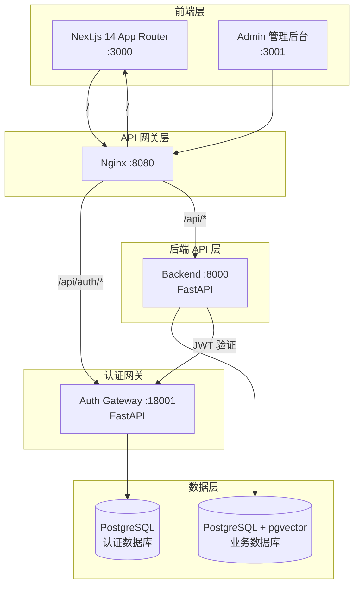
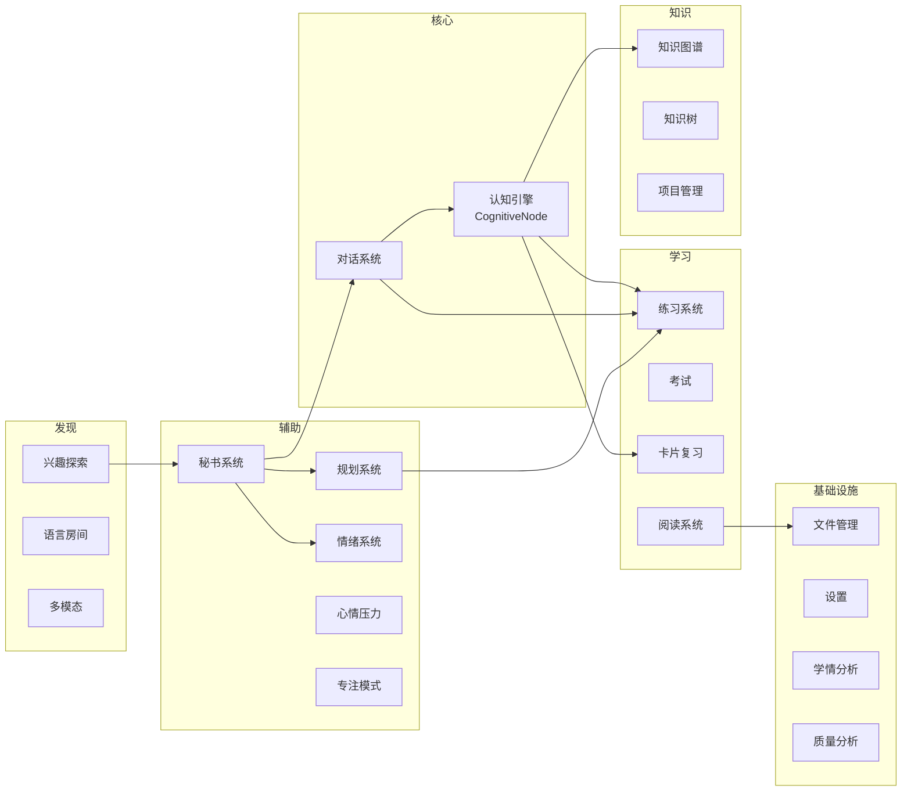
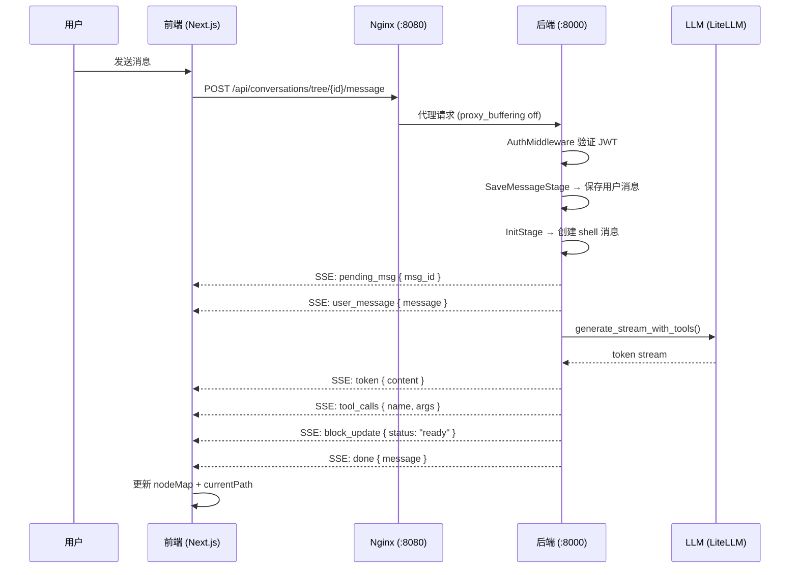
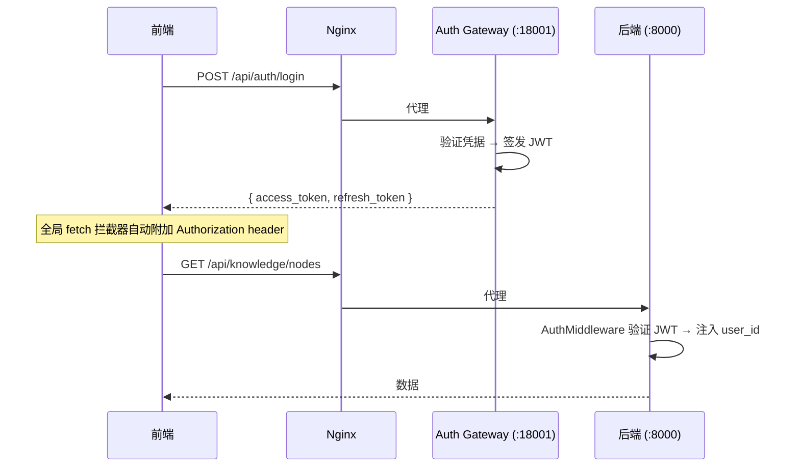
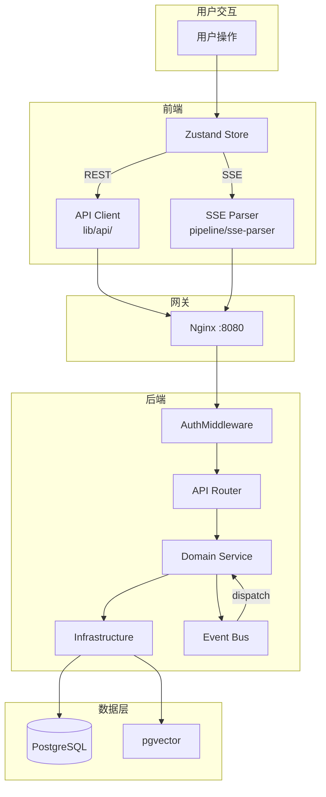

# 系统架构总览 v9.0

> 版本: v9.0.0 | 最后更新: 2026-07-07
> 本次更新：全面反映当前真实架构，包含分层结构、核心模块清单、通信方式、前端架构、数据流。

---

## 一、项目概述

苹果果是一个 AI 驱动的个人知识体系构建工具，提供自主学习规划、精准答疑、多模态交互、知识追踪、个性化陪伴等功能。

### 技术栈

| 层级 | 技术 | 说明 |
|------|------|------|
| 前端 | Next.js 14 (App Router) + React 18 + Tailwind CSS | SSR/CSR 混合，CSS Variables 主题切换，5 套设计风格 |
| 状态管理 | Zustand | 分模块 store（conversation、agent、notification、pipeline、explain） |
| 后端 | Python FastAPI | 异步高性能，OpenAPI 自动文档，Lifespan 事件管理 |
| 数据库 | PostgreSQL 14+ + pgvector | JSONB 灵活存储 + 向量检索（HNSW 索引） |
| 向量模型 | granite-embedding-97m (OpenVINO) | 384 维，mean pooling + L2 norm |
| LLM 路由 | LiteLLM | 统一路由，支持 OpenAI / DeepSeek / 通义千问 / Anthropic 等 100+ 模型 |
| 认证 | 独立认证网关 (FastAPI :18001) | 与业务后端完全解耦，独立 JWT 管理 |
| 加密 | cryptography (Fernet) | API Key 等敏感信息加密存储 |
| 反向代理 | Nginx (:8080) | 统一入口，路由分发，SSE 长连接支持 |
| 管理后台 | Next.js 14 admin (:3001) | 独立项目，用户管理 / 数据管理 / 监控 |
| 部署 | Shell 脚本 + Nginx | rebuild.sh 一键重启，多进程管理 |

---

## 二、系统分层架构



### 2.1 各层职责

| 层 | 组件 | 端口 | 职责 |
|----|------|------|------|
| 前端层 | Next.js 14 App Router | 3000 | 用户界面、SSR/CSR 渲染、5 套设计风格 |
| 前端层 | Admin 管理后台 | 3001 | 用户管理、数据监控、系统设置 |
| API 网关 | Nginx | 8080 | 统一入口、路由分发、静态资源、SSE 代理 |
| 认证网关 | Auth Gateway | 18001 | 注册/登录、JWT 签发、Token 刷新、头像服务 |
| 后端 API | FastAPI | 8000 | 业务逻辑、LLM 调用、事件总线、数据持久化 |
| 数据层 | PostgreSQL | 5432 | 业务数据、向量存储、认证数据 |

### 2.2 Nginx 路由规则

```
Nginx (:8080)
├── /api/auth/*          → Auth Gateway (:18001)     # 注册、登录、Token
├── /api/conversations/ws → Auth Gateway (:18001)    # WebSocket 升级
├── /api/*               → Backend (:8000)           # 业务 API（含 SSE）
├── /avatars/            → Auth Gateway (:18001)     # 头像静态资源
└── /                    → Frontend (:3000)           # Next.js 页面
```

---

## 三、后端分层架构

```
backend/
├── app/
│   ├── api/                    # 表示层 — REST API 路由
│   │   ├── conversation/       # 对话 API（树消息、SSE 流、WS）
│   │   ├── knowledge/          # 知识图谱 API
│   │   ├── knowledge_tree.py   # 知识树 API（四实体解耦）
│   │   ├── knowledge_tree_ai.py    # 知识树 AI 对话
│   │   ├── knowledge_tree_sse.py   # 知识树 SSE 流
│   │   ├── learning/           # 学习 API（进度、画像、认知、增强）
│   │   ├── practice/           # 练习 API（题库、会话、错题、出题、统计、导入、解释卡片、质量）
│   │   ├── system/             # 系统 API（秘书、搜索、成就、文件管理、多模态、摘要、数据管理）
│   │   ├── project/            # 项目工作台 API
│   │   ├── planning/           # 规划 API（ADR 0006）
│   │   ├── reading/            # 阅读 API（ADR 0003）
│   │   ├── liveroom/           # LanguageRoom 实时语音房间 API（ADR 0004）
│   │   ├── interest/           # InterestExplorer 学术信息发现 API（ADR 0007）
│   │   ├── flashcard/          # FlashCard 间隔重复记忆卡 API
│   │   ├── secretary/          # 秘书 API（心情压力诊断）
│   │   └── admin/              # 管理后台 API
│   │
│   ├── domain/                 # 领域层 — 业务逻辑核心
│   │   ├── conversation/       # 对话域（reply_pipeline、tool_dispatch）
│   │   ├── knowledge/          # 知识域（图谱、认知引擎）
│   │   ├── cognitive/          # 认知引擎（ZPD 调度、贝叶斯信念模型）
│   │   ├── practice/           # 练习域
│   │   ├── secretary/          # 秘书域（诊断引擎、提案生成、模块注册表、事件消费者、工具注册）
│   │   ├── auth/               # 认证域（用户、登录事件、LLM 配置、中间件）
│   │   ├── analytics/          # 分析域
│   │   ├── agents/             # Agent 对话
│   │   └── multimedia/         # 多媒体域
│   │
│   ├── services/               # 应用层 — 服务实现
│   │   ├── conversation/       # 对话服务
│   │   ├── knowledge/          # 知识服务
│   │   ├── knowledge_tree/     # 知识树服务
│   │   ├── practice/           # 练习服务（自适应引擎、导入）
│   │   ├── secretary/          # 秘书服务
│   │   ├── project/            # 项目管理服务
│   │   ├── planning/           # 规划服务（完成回写）
│   │   ├── reading/            # 阅读服务
│   │   ├── liveroom/           # 语言房间服务（AI 角色）
│   │   ├── interest/           # 兴趣探索服务（推送调度）
│   │   ├── flashcard/          # 卡片复习服务
│   │   ├── materials/          # 资料服务
│   │   ├── analytics/          # 分析服务
│   │   ├── common/             # 通用服务（摘要）
│   │   └── admin/              # 管理服务
│   │
│   ├── application/            # 应用编排层
│   │   ├── di.py               # 依赖注入容器
│   │   └── handlers/           # 领域事件处理器
│   │
│   ├── infrastructure/         # 基础设施层
│   │   ├── llm/                # LLM 客户端（tool_registry、tool_repository、tool_executor、tool_dispatch、knowledge_ops_tools、liveroom_tools）
│   │   ├── db/                 # 数据库连接、提案存储、秘书 Schema
│   │   ├── scheduler/          # 后台调度器（事件总线轮询、事件消费、Interest 推送）
│   │   ├── media/              # 媒体处理
│   │   ├── files/              # 文件基础设施
│   │   └── tracing.py          # 全链路追踪
│   │
│   ├── schemas/                # 数据模型（Pydantic）
│   ├── config.py               # 应用配置
│   ├── middleware/              # 中间件（Trace、Auth）
│   └── main.py                 # FastAPI 入口（Lifespan、路由注册、中间件）
│
├── shared/                     # 共享层
│   ├── protocols/              # 仓储协议接口
│   ├── events.py               # 事件定义
│   └── learner_model.py        # 学习模型引擎
│
└── tests/                      # 测试
```

### 3.1 分层原则

| 层 | 职责 | 依赖方向 |
|----|------|----------|
| api/ | HTTP 路由、请求验证、响应序列化 | → domain/, services/ |
| domain/ | 业务规则、领域模型、领域服务 | → shared/protocols |
| services/ | 应用服务、用例编排、外部调用 | → domain/, infra/ |
| application/ | 依赖注入、事件绑定 | → domain/, services/, infra/ |
| infrastructure/ | 外部依赖适配（LLM、DB、调度器） | 无业务依赖 |
| schemas/ | Pydantic 数据模型定义 | 无依赖 |
| shared/ | 协议接口、常量、事件定义 | 无依赖 |

---

## 四、前端架构

### 4.1 路由结构（App Router）

```
frontend/src/app/
├── layout.tsx              # 根布局（AppShell + ClientProviders）
├── page.tsx                # 首页 → Cockpit 驾驶舱
├── login/                  # 登录页
├── conversation/           # 对话系统（消息树、SSE 流）
├── dashboard/              # 智能驾驶舱
├── knowledge-tree/         # 知识树
├── practice/               # 练习系统
│   ├── banks/              # 题库管理（含组卷 compose）
│   ├── sessions/[id]/      # 练习会话
│   ├── history/            # 练习历史
│   ├── errors/             # 错题本
│   ├── generate/           # AI 出题
│   └── review/[qid]/       # 单题回顾
├── exam/                   # 考试模式
├── flashcard/              # 卡片复习
│   ├── review/             # 复习界面
│   └── stats/              # 复习统计
├── focus/                  # 专注模式（全屏）
├── study/                  # 学习规划
├── secretary/              # 秘书面板
│   └── settings/           # 秘书偏好
├── analytics/              # 分析仪表盘
├── emotion/                # 情绪系统
├── project/                # 项目管理
│   ├── [id]/view/          # 项目视图（看板/时间线/知识/文档/大纲/活动）
│   └── templates/          # 项目模板
├── planning/               # 学习规划
│   ├── daily/              # 日计划
│   ├── weekly/             # 周计划
│   ├── goals/              # 目标管理
│   ├── reviews/            # 回顾
│   └── knowledge/          # 知识规划
├── reading/                # 阅读系统
│   ├── materials/[id]/     # 阅读材料
│   ├── notes/              # 阅读笔记
│   └── compare/            # 对比阅读
├── liveroom/               # 语言房间
│   ├── rooms/[id]/         # 房间详情
│   ├── create/             # 创建房间
│   ├── personas/           # AI 角色
│   ├── scenarios/          # 场景
│   └── review/[roomId]/    # 回顾
├── interest/               # 兴趣探索
│   ├── prefs/              # 偏好设置
│   ├── sources/            # 信息源管理
│   ├── tags/               # 标签管理
│   └── weight/             # 权重调整
├── files/                  # 文件管理
│   └── [material_id]/      # 资料详情
├── import/                 # 数据导入
├── quality/                # 质量管理
├── resources/              # 资源管理
├── settings/               # 设置
│   └── data/               # 数据管理
└── not-found.tsx           # 404
```

### 4.2 组件层级

```
AppShell (layout)
├── ClientProviders (ThemeContext + AuthContext + QueryProvider)
│   └── AppShell
│       ├── TopBar (可折叠)
│       ├── Workbench (5 栏桌面布局)
│       │   ├── LeftPanel (侧边栏导航)
│       │   ├── Main (Cockpit / 页面内容)
│       │   └── RightPanel (上下文信息)
│       ├── MobileDrawer (平板抽屉)
│       ├── BottomNav (移动端底部导航)
│       ├── BottomBar (可折叠)
│       ├── AgentFloat (悬浮秘书入口)
│       └── ActionFeedbackToast (操作反馈)
```

### 4.3 状态管理（Zustand）

```
frontend/src/store/
├── conversation/           # 对话状态
│   ├── message-store.ts    # 消息树（nodeMap、currentPath、pathPosMap）
│   ├── conversation-store.ts # 对话列表
│   ├── tree-store.ts       # 树结构
│   ├── tree-helpers.ts     # 树操作辅助
│   └── actions/            # 操作（message-ops、tree-ops、nav-ops、dir-ops、sub-branch）
├── agent/                  # 秘书 Agent 状态
│   └── agent-store.ts
├── pipeline/               # SSE 流处理
│   ├── index.ts            # 流水线主逻辑
│   ├── sse-parser.ts       # SSE 事件解析
│   └── token-throttle.ts   # Token 节流
├── notification/           # 通知系统
│   ├── notification-store.ts
│   ├── notification-service.ts
│   ├── notification-preferences.ts
│   ├── proposal-navigator.ts
│   └── types.ts
└── explain/                # 解释状态
    └── explain-store.ts
```

### 4.4 设计令牌系统

五套设计风格，每套支持浅色/深色双主题，通过 `ThemeContext` 管理：

| 风格 | 代号 | 适用场景 |
|------|------|----------|
| 现代专业风 | `professional` | 高效学习、知识管理 |
| 活力趣味风 | `playful` | 基础学习、轻松场景 |
| 紧凑知识风 | `knowledge` | 深度阅读、知识图谱 |
| 柔和数据风 | `soft-data` | 数据分析、进度追踪 |
| 游戏化激励风 | `gamified` | 成就驱动、进度激励 |

```
ThemeContext
├── theme: 'light' | 'dark'
├── style: DesignStyle (5 种)
├── serifFont: boolean
└── 持久化: localStorage
```

---

## 五、核心模块清单

### 5.1 模块总览

| 模块 | 后端 API | 前端路由 | 文档 |
|------|----------|----------|------|
| 对话系统 | `/api/conversations/*` | `/conversation` | [modules/conversation-system/](../modules/conversation-system/) |
| 练习系统 | `/api/practice/*` | `/practice/*` | [modules/practice-system/](../modules/practice-system/) |
| 知识图谱 | `/api/knowledge/*` | `/knowledge-tree` | [modules/knowledge-graph/](../modules/knowledge-graph/) |
| 卡片复习 | `/api/flashcard/*` | `/flashcard/*` | [modules/flashcard/](../modules/flashcard/) |
| 阅读系统 | `/api/reading/*` | `/reading/*` | [modules/reading/](../modules/reading/) |
| 语言房间 | `/api/liveroom/*` | `/liveroom/*` | [modules/language-room/](../modules/language-room/) |
| 规划系统 | `/api/planning/*` | `/planning/*` | [modules/planning/](../modules/planning/) |
| 兴趣探索 | `/api/interest/*` | `/interest/*` | [modules/interest-explorer/](../modules/interest-explorer/) |
| 秘书系统 | `/api/secretary/*` | `/secretary/*` | [modules/secretary-system/](../modules/secretary-system/) |
| 心情压力 | `/api/mood-stress/*` | `/emotion` | [modules/mood-stress/](../modules/mood-stress/) |
| 认知引擎 | `/api/learning/cognitive/*` | — | [modules/cognitive-engine/](../modules/cognitive-engine/) |
| 情绪系统 | — | `/emotion` | [modules/emotion-system/](../modules/emotion-system/) |
| 项目管理 | `/api/project/*` | `/project/*` | [modules/project-based-exploration/](../modules/project-based-exploration/) |
| 文件管理 | `/api/files/*` | `/files/*` | [modules/file-management/](../modules/file-management/) |
| 设置 | `/api/settings/*` | `/settings/*` | [modules/settings/](../modules/settings/) |
| 多模态 | `/api/multimodal/*` | — | [modules/multimodal/](../modules/multimodal/) |
| 驾驶舱 | `/api/learning/*` | `/dashboard` | — |
| 学情分析 | — | `/analytics` | — |
| 专注模式 | — | `/focus` | — |
| 资源管理 | — | `/resources` | — |
| 考试 | — | `/exam` | — |
| 质量分析 | — | `/quality` | — |
| 数据导入 | — | `/import` | — |

### 5.2 模块依赖关系



---

## 六、前后端通信方式

### 6.1 通信方式总览

| 方式 | 用途 | 端点示例 | 说明 |
|------|------|----------|------|
| REST API | CRUD 操作 | `GET /api/knowledge/nodes` | 通过 Nginx 代理到后端 :8000 |
| SSE (Server-Sent Events) | 流式对话 | `POST /api/conversations/tree/{id}/message` | 逐 token 推送，支持 tool_calls 事件 |
| WebSocket | 部分实时场景 | `/api/conversations/ws` | 通过 Nginx Upgrade 代理到 Auth Gateway |

### 6.2 SSE 流式对话数据流



### 6.3 认证流程



---

## 七、数据流全景

### 7.1 从用户操作到数据持久化



### 7.2 事件驱动架构

事件总线是系统内部模块间通信的核心机制：

```
业务层 (API / Services)
    │
    ├── event_bus.publish(DomainEvent)  ← 唯一入口
    │
    ▼
PersistentEventBus
    ├──▶ 立即 dispatch 到所有 handlers
    ├──▶ EventStore.append() → PostgreSQL (不可变持久化)
    └──▶ EventMemory.remember() → 内存 RingBuffer

事件类型与订阅（11 个事件类型，20+ 订阅）:
┌──────────────────────────────────────────────────────┐
│ AnswerSubmitted    → analytics, habit, knowledge      │
│ ErrorRecorded      → knowledge, media                 │
│ SessionCompleted   → session_bridge, planning         │
│ AssistantReplied   → multimedia, aggregator, secretary│
│ CognitiveNodeUpdated → planning, ZPD, practice        │
│ MessageClassified  → visibility_cascade, proposals    │
│ PracticeSubmitted  → cognitive_bayesian_update        │
│ NodeCreated        → ripple_edge_detection            │
│ ProposalAccepted   → mark_expanded                    │
│ PendingCrossTopic  → cross_topic_proposals            │
└──────────────────────────────────────────────────────┘
```

### 7.3 AI Tool 调用链路

```
用户消息 → Regex 预检测 或 LLM Function Calling
    │
    ├── 匹配 → ToolExecutor.execute(name, params)
    │           ├── Fast Tool: 同步执行 → ResponseBlock(status="ready")
    │           └── Slow Tool: 创建占位 → 后台任务 → 前端轮询
    │
    └── 未匹配 → LLM generate(tools=schemas)
                  └── tool_calls → ToolExecutor → 二次 LLM 调用
```

---

## 八、认证架构

### 8.1 独立认证网关

```
前端 → Nginx (:8080) → Auth Gateway (:18001) → 认证数据库
     → Nginx (:8080) → Backend (:8000) → 业务数据库
```

- Auth Gateway 独立进程（`:18001`），独立数据库，负责注册/登录/JWT 签发
- 源码位于 `auth-gateway/auth_app/`：`main.py`、`auth_service.py`、`jwt_service.py`、`user_repo.py`、`security.py`、`database.py`
- 业务后端通过 `AuthMiddleware` 验证 JWT，注入用户上下文
- 前端全局 fetch 拦截器自动附加 `Authorization: Bearer <token>`

### 8.2 用户自定义 LLM 配置

```
前端设置页 → PUT /api/settings/llm → 业务后端
                                         │
                                     ├── Fernet 加密 api_key
                                     ├── 存入 user_llm_configs 表
                                     └── 返回 { ok: true }

对话系统 → LLMService.generate(user_id=xxx)
               │
           ├── 查询 user_llm_configs
           ├── 解密 api_key
           └── 调用 LiteLLM(api_key, api_base, model)
```

### 8.3 登录事件追踪

| 事件 | 存储表 | 数据 | 触发时机 |
|------|--------|------|----------|
| 用户登录 | `login_events` | user_id, ip_address, device_type, browser, os, region, login_time | 每次登录成功 |
| 用户活跃 | `users.last_active_at` | timestamp | 每次认证请求更新（5 分钟 DB 内节流） |

在线状态判定：`last_active_at` 在最近 30 分钟内 → 在线。**单一数据源**，主应用与 admin 共用 `users.last_active_at`；admin `/api/admin/users` 列表直接返回 `is_online`，前端 30 秒轮询刷新。

> **时区约定**：DB 列 `timestamp without time zone` 存 CST 墙钟（与服务器本地时一致）。Python 判定在线时必须用 `datetime.now()`，**禁止** `datetime.utcnow()`。

---

## 九、部署架构

### 9.1 进程拓扑

```
┌─────────────────────────────────────────────────────┐
│                    Nginx (:8080)                     │
│  路由分发、反向代理、SSE 长连接、静态资源              │
├─────────────────────────────────────────────────────┤
│  Frontend          │  Admin          │  Auth Gateway │
│  Next.js :3000     │  Next.js :3001  │  FastAPI      │
│                    │                 │  :18001       │
├────────────────────┴─────────────────┴──────────────┤
│               Backend (FastAPI :8000)                │
│  业务逻辑、LLM 调用、事件总线、后台调度器              │
├─────────────────────────────────────────────────────┤
│              PostgreSQL + pgvector                   │
│  业务数据库 + 认证数据库                              │
└─────────────────────────────────────────────────────┘
```

### 9.2 启动脚本

- `rebuild.sh`：一键重启前后端（构建前端 → 安装依赖 → 重启进程）
- `startup.sh`：启动所有服务
- `shutdown.sh`：停止所有服务

---

## 十、数据库分区

| 数据库 | 用途 | 归属 |
|--------|------|------|
| 业务数据库 (PostgreSQL) | CognitiveNode、对话、图谱、练习、事件、login_events、user_llm_configs、planning、reading、liveroom、flashcard、interest 等 | 业务后端 |
| 认证数据库 (PostgreSQL) | 用户、凭据、JWT | 认证网关 |

### 10.1 核心实体

- **CognitiveNode**：系统中所有知识点的统一表征，详见 [specs/01-cognitive-node.md](../specs/01-cognitive-node.md)
- **MessageNode**：对话消息树节点，支持父子关系、版本、分支切换，详见 [message-tree.md](message-tree.md)
- **EventRecord**：不可变事件，含 `stream_type`、`stream_id`、`payload`、`embedding`，详见 [event-system-v2.md](event-system-v2.md)

---

## 十一、核心子系统

| 子系统 | 文档 | 说明 |
|--------|------|------|
| AI Tool 系统 | [tool-architecture.md](tool-architecture.md) | LLM Function Calling 三层架构（SSoT → Aggregation → Execution） |
| 事件系统 v2 | [event-system-v2.md](event-system-v2.md) | EventStore 四级记忆、跨模块桥梁 |
| 事件层次聚合 | [event-hierarchy.md](event-hierarchy.md) | 三维度六窗口聚合（EpisodeDigest / TopicDigest / TypeDigest） |
| 消息树路径 | [message-tree.md](message-tree.md) | 对话树加载策略、路径切换、版本切换、删除重建 |
| 认知引擎 | [../modules/cognitive-engine/overview.md](../modules/cognitive-engine/overview.md) | ZPD 调度、贝叶斯信念模型、激活传播 |
| 秘书系统 | [../modules/secretary-system/overview.md](../modules/secretary-system/overview.md) | 诊断引擎、提案生成、模块注册表、事件消费者 |

---

## 十二、代码规模

| 模块 | 说明 |
|------|------|
| 后端 (Python) | ~36,000 行，~210 文件 |
| 前端 (TS/TSX) | ~19,000 行，~190 文件 |
| 管理后台 (TS/TSX) | ~1,000 行，~12 文件 |
| 认证网关 (Python) | ~2,000 行，~6 文件 |
| **合计** | **~58,000 行，~420 文件** |

---

> 详细架构演进历史见 [archive/](../archive/)。当前架构由 v8.1 (知识树 AI 对话) 演进而来，v9.0 全面反映当前真实架构。